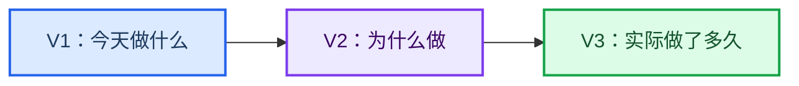

# 粥记产品文档

_面向产品、设计、iOS 开发与测试的统一项目入口；当前已达到 V3 里程碑。_

---

## 📋 项目简介

粥记是一款面向 iPhone 的极简任务与目标记录工具。它不要求用户规划具体时间、设置优先级或维护复杂分类，只关注三个问题：

1. 今天做什么？
2. 为什么做？
3. 实际做了多久？

产品口号：

> 不用规划那么多，先把今天的事做完。

## 📚 文档导航

| 文档 | 主要读者 | 用途 |
| --- | --- | --- |
| [产品总览](docs/01-产品总览.md) | 决策者、产品、设计 | 快速了解定位、原则、版本演进与产品边界 |
| [产品需求文档 PRD](docs/02-产品需求文档-PRD.md) | 产品、设计、开发、测试 | 产品行为、交互规则、数据口径与验收标准的唯一准则 |
| [V1–V3 实施路线图](docs/03-V1-V3-实施路线图.md) | iOS 开发、测试、项目负责人 | 技术基线、版本增量、数据演进、测试与交付要求 |
| [微信与 Universal Links](docs/04-微信开放平台与UniversalLinks.md) | iOS 开发、运维 | 微信平台填写值、域名关联、签名要求与接入边界 |
| [云同步产品需求增量](docs/05-云同步产品需求增量.md) | 产品、开发、测试 | 同步归属、删除、冲突、多设备计时与验收；实现前决策清单 |
| [登录与同步后端](server/README.md) | 后端开发、运维 | FastAPI / MySQL 基础服务、配置、测试与部署准备 |

## 📍 推荐阅读顺序

1. 阅读[产品总览](docs/01-产品总览.md)，建立统一的产品认知
2. 阅读[产品需求文档 PRD](docs/02-产品需求文档-PRD.md)，确认产品行为和验收规则
3. 阅读[V1–V3 实施路线图](docs/03-V1-V3-实施路线图.md)，按版本组织开发和测试
4. 账户同步增量阅读[云同步 PRD](docs/05-云同步产品需求增量.md)：R1–R5 为待确认调整，不代表同步已实现

## ⚙️ 文档职责

| 决策类型 | 权威文档 |
| --- | --- |
| 产品定位、长期原则、版本方向 | 产品总览 |
| 页面行为、交互、状态、统计口径 | 产品需求文档 PRD |
| 技术选型、实现顺序、数据演进、交付检查 | V1–V3 实施路线图 |

当文档之间出现冲突时，按照以下规则处理：

1. 产品行为以 PRD 为准
2. 技术实现不得改变 PRD 定义的外部行为
3. 路线图需要随 PRD 的正式变更同步更新
4. 尚未写入 PRD 的功能不自动进入开发范围

## 📊 当前状态

| 项目 | 状态 |
| --- | --- |
| 产品阶段 | V3 已完成，进入整体体验验收与旧系统兼容评估 |
| 首发平台 | iPhone |
| 开发语言 | Swift |
| 界面框架 | SwiftUI |
| 本地存储 | SwiftData |
| V1–V3 最低系统 | iOS 17 |
| 账户与后端 | V3 后新增迭代：Python + FastAPI + MySQL；Apple / 微信登录代码已完成，云同步未上线 |
| 旧系统兼容 | V3 完成后单独评估 |

## ✅ 当前实现

| 能力 | 实现状态 |
| --- | --- |
| 今天任务 | 新增、完成、恢复、跨天保留、软删除与 5 秒撤销 |
| 基础计时 | 开始、暂停、继续、结束、切换确认与中断恢复 |
| 目标 | 新建、名称与图标设置、任务归属、自动进度、删除确认与任务脱离 |
| 记录 | 今日/本周完成数与有效时长、按目标汇总本周投入 |
| 数据 | SwiftData 本地持久化、任务/目标软删除、计时名称快照 |
| 主题与辅助功能 | 浅色/深色模式、动态字体、VoiceOver 标签、减少动态效果 |
| 账户 | 游客可用；Apple / 微信登录（均有真机成功记录）、钥匙串会话、昵称头像；云同步未上线 |
| 数据保护 | JSON 导出恢复已有基础实现；异常恢复、迁移验证、服务端备份演练待补，见同步阶段 A |

核心代码位于 `ios/ZhouJi/`，单元测试位于 `ios/ZhouJiTests/`，界面验收测试位于 `ios/ZhouJiUITests/`。

V3 已开放“今天”“目标”“记录”三个一级入口。统计直接聚合既有任务与计时事实，不复制或回写累计数据；删除任务或目标也不会改变历史计时快照。

## 🔧 本地运行

官网前端位于 [`website/`](website/README.md)，按官网 UI 参考图实现，无需后端与第三方依赖。预览方式、上架链接配置与验证说明见官网目录文档。

工程文件：[ios/ZhouJi.xcodeproj](ios/ZhouJi.xcodeproj)

1. 使用 Xcode 打开 `ios/ZhouJi.xcodeproj`
2. 选择一个 iPhone 模拟器
3. 运行 `ZhouJi` Scheme

如修改了 `ios/project.yml` 或增加源文件，可以重新生成工程：

```bash
cd ios
xcodegen generate
```

运行测试：

```bash
xcodebuild -project ios/ZhouJi.xcodeproj \
  -scheme ZhouJi \
  -destination 'platform=iOS Simulator,name=iPhone 17 Pro' \
  test
```

## 🔄 版本概览



## 🎯 文档维护原则

- 使用简体中文描述产品规则，Swift 类型名保留英文
- 每项需求必须归属明确版本并具备可验证的验收条件
- 新功能必须证明其价值高于新增的操作和学习成本
- 不以增加功能数量作为产品进展
- 旧系统兼容范围依据 V3 后的真实设备数据决定
