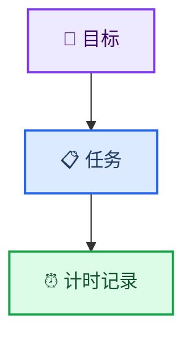

# 粥记产品总览

_用于快速理解粥记的产品定位、核心价值、版本演进与边界。_

---

## 📋 产品定义

| 项目 | 定义 |
| --- | --- |
| 产品名称 | 粥记 |
| 产品类型 | 极简任务与目标记录工具 |
| 首发平台 | iPhone |
| 产品阶段 | 0 → 1 |
| 核心用户价值 | 少想一点，记下来，然后开始做 |

> 粥记是一个不用规划具体时间、不用设置优先级，只关注“今天做什么、为什么做、实际做了多久”的极简 Todo App。

推荐口号：

> 不用规划那么多，先把今天的事做完。

## 👤 目标用户

粥记服务于有事情要推进，但不愿维护复杂任务系统的个人用户。

| 用户类型 | 典型需求 |
| --- | --- |
| 学生 | 考研、考公、写论文、学习编程、准备考试 |
| 自由职业者 | 围绕长期目标安排每日工作，但时间比较自由 |
| 个人开发者 | 记录每日任务和项目实际投入 |
| 轻量工具偏好者 | 希望打开 App 后立即记录，不设置优先级、标签和日程 |

共同特征：

- 不想为一条简单任务填写大量属性
- 不愿精确预测几点开始、几点结束或需要多久
- 希望看见每天的行动与长期目标之间的联系
- 更关注真实投入，而不是计划是否完美

## 🎯 核心问题

| 用户问题 | 产品回答 | 首次提供版本 |
| --- | --- | --- |
| 今天要做什么？ | 今天 | V1 |
| 每天做这些事情是为了什么？ | 目标 | V2 |
| 时间真正花到了哪里？ | 计时与记录 | V1 计时、V3 汇总 |

产品只围绕三个核心概念展开：

## ⚡ 产品原则

### 快速记录

普通任务只需要输入名称即可创建。优先级、截止时间、标签、提醒和预计时长均不是必填项，也不在 V1–V3 范围内。

### 不要求提前规划

粥记不提供时间轴或日历排布。用户只需要决定这件事是否要做，不需要提前决定几点完成。

### 不制造逾期焦虑

普通任务没有截止时间。未完成任务继续保留，但不出现红色逾期警告或“已逾期 N 天”的提示。

### 记录真实投入

计时从零开始，记录实际发生的投入，不要求预计时长，也不强制番茄工作法。

### 让进度自然产生

长期目标的进度由任务完成情况自动计算，用户不能手动填写百分比、权重或得分。

### 功能少是一种能力

新功能只有在没有它就无法顺利完成核心任务时才应加入。任何让新增任务明显变慢或让新用户必须学习的功能，都需要被谨慎拒绝。

## 🔄 核心闭环

```mermaid
flowchart LR
    accTitle: 粥记用户核心闭环
    accDescr: 用户从建立目标开始，通过每日任务、实际计时和完成反馈持续推动目标前进。

    create_goal["🎯 建立目标"] --> add_task["📋 添加小任务"]
    add_task --> start_work["⚡ 开始做"]
    start_work --> record_time["⏰ 记录投入"]
    record_time --> complete_task["✅ 完成任务"]
    complete_task --> update_goal["📈 目标前进"]
    update_goal --> review_record["📊 查看记录"]
    review_record --> next_day["🔄 继续下一天"]
    next_day --> add_task

    classDef action fill:#dbeafe,stroke:#2563eb,stroke-width:2px,color:#1e3a5f
    classDef success fill:#dcfce7,stroke:#16a34a,stroke-width:2px,color:#14532d
    classDef insight fill:#ede9fe,stroke:#7c3aed,stroke-width:2px,color:#3b0764

    class create_goal,add_task,start_work,record_time action
    class complete_task,update_goal success
    class review_record,next_day insight
```

## 📈 版本演进

| 版本 | 核心问题 | 新增能力 | 主导航 |
| --- | --- | --- | --- |
| V1 | 今天做什么？ | 任务新增、完成、恢复、删除、基础计时、本地保存 | 今天 |
| V2 | 为什么做？ | 目标、新建目标、任务归属、自动进度 | 今天、目标 |
| V3 | 实际做了多久？ | 今日与本周统计、按目标汇总实际投入 | 今天、目标、记录 |

版本升级必须保持增量：V2 不得让普通任务创建变复杂，V3 不得改变 V1 已形成的计时习惯。

## 🚫 明确非目标

V1–V3 不提供：

- 日历、时间轴和时间块
- 截止日期、逾期提醒和通知提醒
- 优先级、重要程度、标签和颜色分类
- 多级项目、子项目、子任务和目标嵌套
- OKR、KPI、任务权重和手动进度
- 重复任务、习惯打卡和复杂番茄钟
- 排行榜、好友、动态、点赞等社交能力
- AI 自动拆解或推荐
- 账户、登录、后端和云同步
- Widget 和 Apple Watch 客户端

## 🎨 产品气质

| 维度 | 方向 |
| --- | --- |
| 视觉 | 米白、深灰、少量暖色，保持留白 |
| 感受 | 温和、安静、日常、没有压力 |
| 操作 | 打开即用，主要行为一步可达 |
| 品牌 | 像每天喝粥一样简单地记录一点，但核心仍然是做事 |

避免大面积高饱和色、密集卡片、复杂数据图、游戏化图标和红色逾期警告。

## 📊 成功标准

V1 首先验证产品价值，而不是下载量或收入：

- 新用户首次打开即可创建任务，不需要教程
- 用户愿意在第二天继续打开粥记
- 记录任务比使用系统备忘录更直接
- 整体体验比复杂 Todo 工具更轻
- 关闭并重新打开 App 后，任务、完成状态和计时数据仍然正确

首版完全免费，不设置会员、广告、付费解锁或数量限制。商业化不属于 V1–V3 的验证目标。

## 🔍 新功能判断标准

每个候选功能进入规划前必须回答：

1. 没有它，核心任务是否无法完成？
2. 加入后是否会让新增任务变慢？
3. 它是否会让新用户必须学习？

当功能价值有限且明显增加复杂度时，不进入当前版本。

