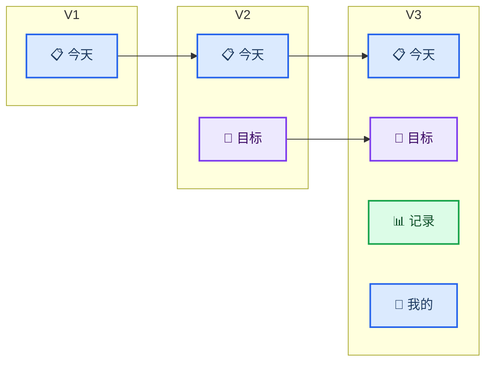
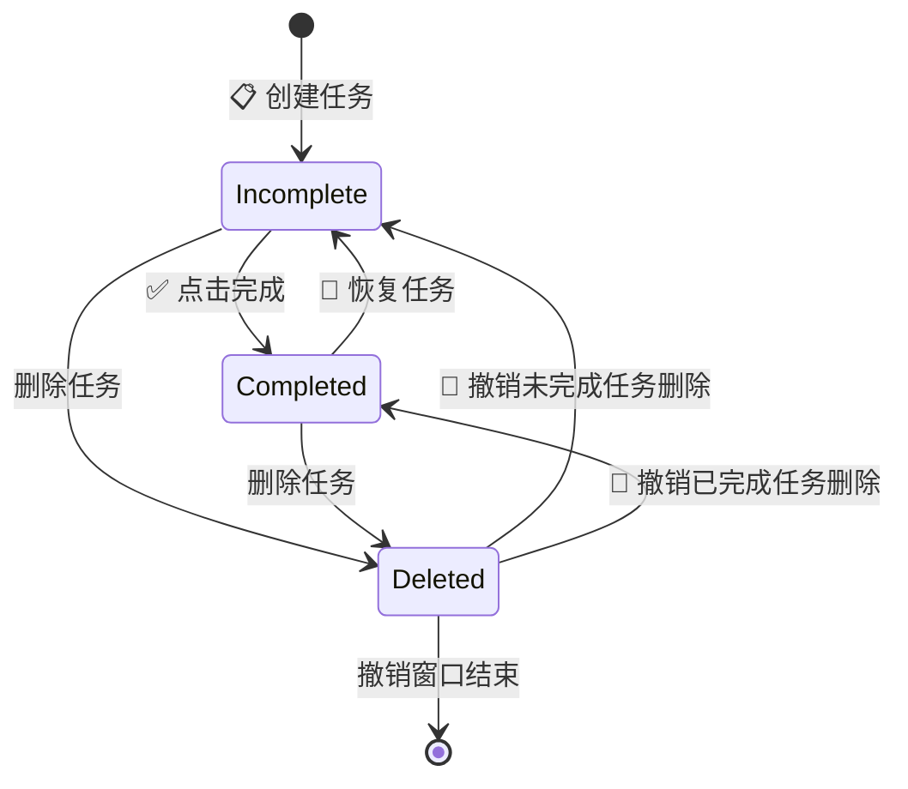
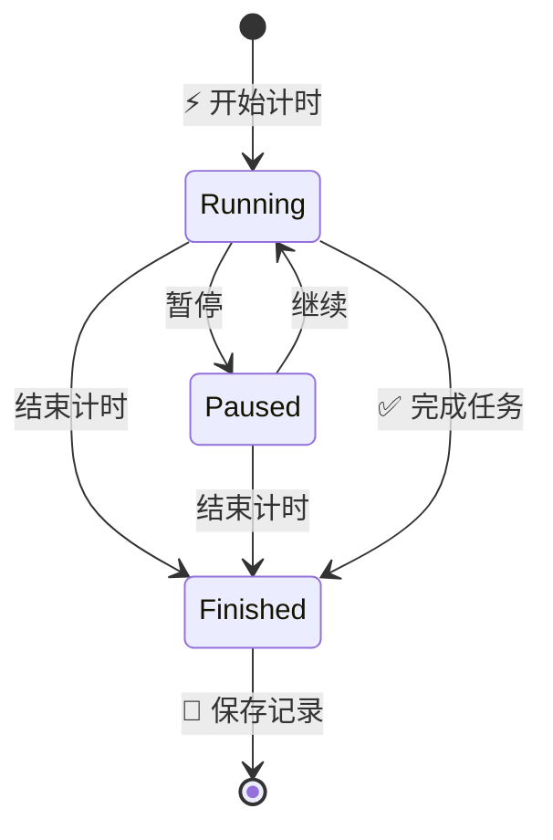
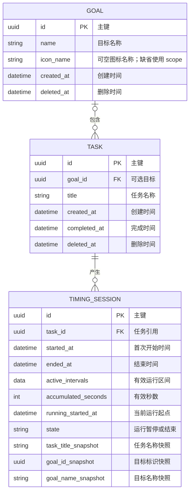

# 粥记产品需求文档 PRD

_定义粥记 V1–V3 的产品行为、交互规则、数据口径和验收标准；产品行为以本文档为准。_

---

## 📋 文档信息

| 项目 | 内容 |
| --- | --- |
| 产品名称 | 粥记 |
| 产品类型 | 极简任务与目标记录工具 |
| 首发设备 | iPhone |
| 版本范围 | V1–V3 |
| 最低系统 | iOS 17 |
| 数据方式 | SwiftData 本地保存 |
| 当前阶段 | 产品规划 |

### 产品定位

> 一个不用规划时间、不用设置优先级，只关注“今天做什么、为什么做、实际做了多久”的极简 Todo App。

产品必须让用户无需注册、无需教程，首次打开后直接进入今天页面并创建任务。

### 版本范围

| 版本 | 核心能力 | 不包含 |
| --- | --- | --- |
| V1 | 今天、任务、基础计时 | 目标、记录页、账户、云同步 |
| V2 | V1 全部能力、目标、任务归属、自动进度 | 记录页、复杂项目管理 |
| V3 | V2 全部能力、记录与统计 | 专业分析、排行、AI |

## 📍 信息架构



### 导航规则

- V1 启动后直接进入今天页面，不显示底部导航
- V2 使用“今天、目标”两个一级入口
- V3 使用“今天、目标、记录、我的”四个一级入口；“我的”承载本地概览与外观设置
- 每次冷启动默认进入今天页面
- App 不设置欢迎页、注册页或登录页

## ✍️ 今天与任务

### 页面目标

用户进入 App 后立即知道还有哪些事情没有完成，并能快速新增、完成或开始计时。

### 页面结构

页面从上到下包含：

1. 产品名称或简洁标题
2. 当前日期与“今天”标识
3. 未完成任务区
4. 当天已完成任务区
5. 添加任务入口

任务行包含：

- 左侧完成状态按钮
- 任务名称
- V2 起可选的弱化目标名称
- 右侧计时按钮

### 展示范围

- 未完成区展示所有未删除且未完成的任务，包括此前日期创建但尚未完成的任务
- 已完成区只展示设备本地自然日内完成的任务
- 前一天未完成的任务自然延续，不修改创建时间
- 不显示任务逾期天数，不使用逾期警告
- 已软删除任务不出现在任何日常任务列表中

### 排序规则

- 未完成任务按创建时间升序排列，新任务追加在未完成区末尾
- 已完成任务按完成时间降序排列，最近完成的任务排在前面
- 恢复任务后，它返回未完成区，并按照原创建时间参与排序

### 空状态

| 场景 | 表现 |
| --- | --- |
| 没有任何任务 | 显示简短空状态和“添加任务”入口 |
| 没有未完成任务 | 显示“今天的事都完成了”并保留当天已完成任务 |
| 没有当天已完成任务 | 不显示空的已完成分组 |

## ⚡ 新增任务

### 基本流程

1. 用户点击“添加任务”
2. 页面直接进入文本输入状态并弹出键盘
3. 用户输入任务名称
4. 用户点击“添加”或使用键盘提交
5. 新任务立即出现在未完成区末尾

### 字段规则

| 字段 | V1 | V2–V3 | 规则 |
| --- | --- | --- | --- |
| 任务名称 | 必填 | 必填 | 去除首尾空白后不能为空 |
| 所属目标 | 不提供 | 可选 | 最多选择一个未删除目标 |

不提供描述、截止时间、优先级、标签、提醒、预计时长和颜色字段。

### 异常处理

- 输入为空或只有空白字符时，“添加”不可用
- 保存失败时保留用户输入并显示轻量错误提示
- 连续点击提交不得创建重复数据
- 取消新增时不保存内容

## ✅ 完成与恢复

### 完成任务

点击未完成任务左侧圆圈后：

- 立即设置完成状态和完成时间
- 将任务移动到当天已完成区
- V2 起立即更新所属目标进度
- V3 起立即更新当天和本周完成数量
- 不显示确认框

如果任务正在计时，完成操作先结束并保存当前计时，再完成任务。

### 恢复任务

点击已完成任务的完成标记后：

- 将任务恢复为未完成
- 清除原完成时间
- 将任务移回未完成区
- 立即回退目标进度和完成数量统计
- 不显示确认框

### 任务状态



业务上只向用户展示“未完成”和“完成”两种状态；删除是数据保留策略，不作为可见任务状态。

## ⏰ 任务计时

### 入口与显示

- 未完成任务右侧显示开始计时按钮
- 已完成任务不显示计时按钮；需要继续计时时应先恢复任务
- 计时页显示任务名称、已投入时长、当前状态和操作按钮
- “结束计时”和“完成任务”使用不同文案，避免语义混淆

### 计时流程



### 计时规则

- 从零开始正向计时，不预设时长
- 只累计运行状态的有效秒数，暂停时长不计入
- 一次任务可以产生多次独立计时
- 同一次计时允许多次暂停和继续
- 全局最多存在一个运行中或暂停中的计时
- 结束计时仅保存投入，不自动完成任务
- 计时结果至少按秒保存，界面可以按秒或分钟友好展示

### 切换计时任务

当另一个任务存在未结束计时时，用户点击新任务的开始按钮：

1. 显示当前计时任务名称
2. 询问是否结束并保存当前计时，然后开始新任务
3. 确认后先保存旧计时，再启动新计时
4. 取消后继续原计时，不改变任何数据

不允许两个任务同时计时。

### App 生命周期

- 每次开始、暂停、继续和结束都立即持久化关键状态
- 运行状态下进入后台时，计时按真实时间继续
- 暂停状态下进入后台时，不增加时长
- App 被系统终止或用户重新打开后，根据持久化时间恢复状态和正确时长
- 设备时间变化时，以持久化时间点计算并避免产生负时长
- 保存失败时不得把尚未落盘的计时显示为已完成保存

## 🎯 目标

### 目标页面

V2 增加目标页面，每个目标显示：

- 目标图标
- 目标名称
- 自动计算的进度百分比
- 已完成任务数与任务总数

页面提供“新建目标”入口。删除目标后，该目标不再出现。

### 新建目标

创建目标时，目标名称是唯一必填字段，去除首尾空白后不能为空；图标默认使用“目标”图标，创建后可在目标设置中修改。不要求填写描述、截止时间、颜色、优先级、权重或 KPI。

### 目标详情

目标详情显示：

- 目标名称与自动进度
- 属于该目标的未删除任务
- “添加任务”入口；从此入口创建的任务自动归属当前目标
- “目标设置”入口；可以修改目标名称，并从内置图标中选择一个目标图标

设置保存后，目标列表和当前记录页立即显示最新名称与图标。历史计时保存的目标名称快照不随目标重命名而修改；旧数据没有图标字段时使用默认“目标”图标。

V1–V3 不提供目标嵌套、子目标或手动调整百分比。

### 任务归属

- 一个目标可以包含多个任务
- 一个任务最多属于一个目标
- 新增普通任务时可以不选择目标
- 目标名称在今天页面作为弱化辅助信息，任务名称始终是视觉主体
- V1 不显示任何目标字段或入口

### 进度口径

```text
目标进度 = 已完成且未删除的任务数 ÷ 该目标下未删除的任务总数
```

| 场景 | 结果 |
| --- | --- |
| 目标没有任务 | `0%` |
| 添加未完成任务 | 分母增加，进度重新计算 |
| 完成任务 | 分子增加，进度立即更新 |
| 恢复任务 | 分子减少，进度立即更新 |
| 删除任务 | 从分子和分母中排除 |
| 删除目标 | 目标消失，任务保留并变为无目标 |

## 📊 记录与统计

### 页面目标

V3 的记录页面只回答：今天完成了多少、本周完成了多少、实际投入了多久、时间投入到了哪些目标。

### 展示内容

| 区域 | 指标 |
| --- | --- |
| 今天 | 完成任务数、有效计时时长 |
| 本周 | 完成任务数、有效计时时长 |
| 目标投入 | 本周各目标的有效计时时长，按时长降序 |

无数据时显示 `0 件`、`0 分钟`，目标投入区显示简短空状态。

记录页顶部使用“今天 / 本周”切换栏，点击后滚动定位到对应统计区，两个周期的数据仍保留在同一页面。今日完成数与昨天比较，本周完成数、有效计时时长与上一完整自然周比较；增加、减少和相同分别如实表达，比较结果从任务和有效计时区间即时计算。

目标投入的标题与明细放在同一张卡片中；未删除目标可以点击进入目标详情，已删除目标只展示历史投入，不提供失效跳转。

### 时间边界

- “今天”使用设备当前本地时区的 `00:00:00` 至下一自然日 `00:00:00`
- “本周”从设备本地时间周一 `00:00:00` 开始，到下一周周一 `00:00:00` 结束
- 完成任务数按照任务的完成时间归属统计周期
- 恢复任务会清除完成时间，因此原周期完成数量同步回退
- 有效计时按照实际运行区间归属统计周期
- 跨越午夜或周界的计时按时间边界拆分计入对应周期
- 暂停区间不计入任何统计

### 目标投入归属

- 开始计时时保存当时的任务名称和目标快照
- 删除任务或目标后，历史计时时长不减少
- 删除目标后，历史记录继续使用原目标名称参与对应周期汇总
- 无目标任务的计时计入总时长，但不进入具体目标排行
- 后续计时使用任务当时的最新归属，不反向修改旧记录

### 数据分析边界

V3 不提供趋势图、专业分析、专注评分、排行、热力图、AI 总结或激励打卡。

## 💾 数据模型



### 模型约束

- 所有标识使用稳定唯一值
- `Task.goalId` 可以为空
- `Task.completedAt` 为空表示未完成，非空表示完成
- `deletedAt` 非空的数据不出现在常规列表，但仍可供历史统计关联
- `TimingSession.activeIntervals` 按顺序保存每段连续运行的开始和结束时间，是跨日期统计的事实来源
- 当前正在运行的区间由 `runningStartedAt` 表示，暂停或结束时闭合并追加到 `activeIntervals`
- `accumulatedSeconds` 与全部已闭合区间时长之和保持一致，用于快速展示而不是替代区间事实
- `TimingSession` 的未结束状态只允许全局存在一条
- `TimingSession` 结束后不再修改其任务和目标快照
- V1 已创建 `Task` 和 `TimingSession`；V2 增加 `Goal` 及可选关系；V3 不改变计时事实数据

## 🔄 删除与数据保留

### 删除任务

- 使用左滑删除
- 删除后立即从列表消失
- 页面显示 5 秒撤销入口
- 撤销时恢复删除前的完成状态、完成时间和目标关系
- 撤销窗口结束后仍采用软删除，不物理清除计时历史
- 删除任务从目标当前进度的分子和分母中排除

### 删除目标

删除前显示确认信息：目标将消失，其中任务会保留，但不再属于该目标。

确认后：

- 目标被软删除并从目标页面消失
- 该目标下未删除任务的当前目标关系被清空
- 任务状态、完成时间和计时不改变
- 已结束计时中的目标快照不改变
- 正在进行的计时保留开始时的目标快照

### 数据清除边界

V1–V3 不提供回收站、批量删除、自动清理、账户注销或云端数据删除功能。

## 🎨 体验与视觉要求

### 视觉方向

- 按三页视觉参考统一：浅米白背景、近黑正文、灰蓝辅助文字，蓝色用于导航选中态，暖橙色用于计时操作
- 通过留白和文字层级组织信息，使用少量圆角卡片划分任务、目标和统计信息
- 底部导航使用圆角浮动底座与圆形浅蓝选中态，页面内容与操作入口避让导航安全区域
- 今天页完整呈现天空、阶梯与绿植插画；目标卡片使用弱化背景插画，不挤占标题和进度条
- 任务名称是页面视觉主体，目标名称和统计说明弱化
- 完成任务使用灰色勾选、弱化文字与完成时间表达，不叠加删除线；未完成任务保留橙色“开始”按钮
- 不使用高饱和大色块、游戏化图标或红色逾期警告

### 操作反馈

- 完成、恢复和开始计时需要立即反馈
- 删除、保存失败和计时切换使用短而明确的提示
- 不为可安全撤销的轻量操作增加确认框
- 删除目标和切换正在计时的任务需要确认

### 可用性

- 支持动态字体和系统深色模式
- 交互控件具有足够点击区域和 VoiceOver 标签
- 关键状态不能只通过颜色区分
- 用户首次进入即可理解主要操作，不依赖教程

## 🚫 产品边界

V1–V3 明确不实现：

- 日历、日程、截止时间、逾期状态和提醒
- 优先级、标签、颜色分类和预计时长
- 多级项目、子任务、目标嵌套、OKR 和 KPI
- 复杂番茄钟、休息提醒和习惯打卡
- 社交、排行榜、协作和分享动态
- AI 自动拆解、分析或推荐
- 账户、登录、后端、网络依赖和云同步
- Widget、Apple Watch 和多平台客户端
- 复杂报表、热力图和专注评分

## 🧪 验收标准

### V1 验收

- [ ] 首次启动直接进入今天页面，无需登录或引导
- [ ] 只输入非空任务名称即可创建任务
- [ ] 点击一次可以完成任务，再次点击可以恢复
- [ ] 未完成任务跨天继续显示且无逾期提示
- [ ] 可以开始、暂停、继续和结束计时
- [ ] 暂停区间不计入有效时长
- [ ] 同一时刻不能运行两个任务计时
- [ ] App 中断后任务、完成状态和计时能够正确恢复
- [ ] 完成正在计时的任务会先保存计时
- [ ] 删除任务后可以在 5 秒内撤销
- [ ] 关闭并重新打开 App 后数据仍然存在

### V2 验收

- [ ] 可以只输入名称创建目标
- [ ] 可以在目标设置中修改目标名称和图标
- [ ] 旧目标没有图标数据时显示默认图标
- [ ] 任务可以选择一个目标，也可以不选择
- [ ] 从目标详情新增的任务自动归属该目标
- [ ] 完成、恢复和删除任务后，目标进度立即正确更新
- [ ] 空目标显示 `0%`
- [ ] 删除目标需要确认，任务保留并变为无目标
- [ ] 删除目标不会改变历史计时快照
- [ ] 不使用目标功能时，V1 的快速新增流程保持不变

### V3 验收

- [ ] 今日完成数量按本地自然日计算
- [ ] 本周完成数量以周一为一周起点
- [ ] 今日和本周有效计时时长正确
- [ ] 跨午夜和跨周计时按边界正确拆分
- [ ] 按目标汇总的本周投入正确并按时长降序
- [ ] 无目标计时进入总时长但不进入目标排行
- [ ] 删除任务或目标后历史统计不减少
- [ ] 没有数据时显示清晰的零值或空状态
- [ ] V1、V2 已有交互保持不变

## 🔍 需求变更原则

新增或变更功能前必须确认：

1. 是否直接帮助用户回答三个核心问题之一
2. 是否会让普通任务创建变慢
3. 是否会增加新用户的学习成本
4. 是否能在不引入账户、后端和网络依赖的前提下完成
5. 是否具备明确版本归属和可验证的验收条件

不满足以上条件的功能不进入 V1–V3。
