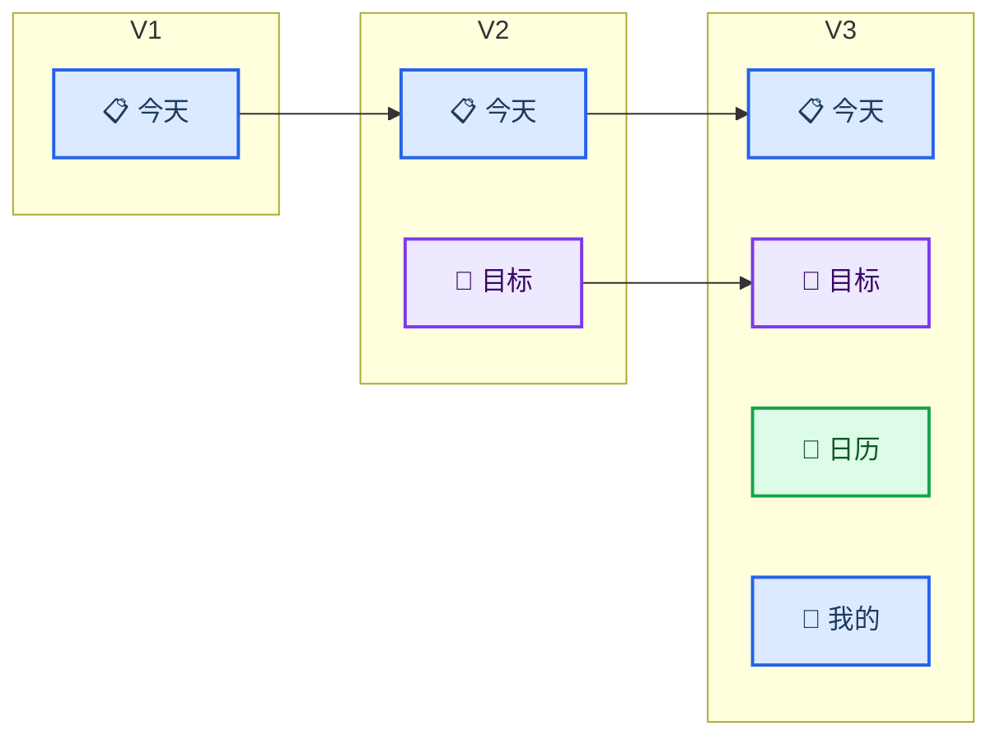
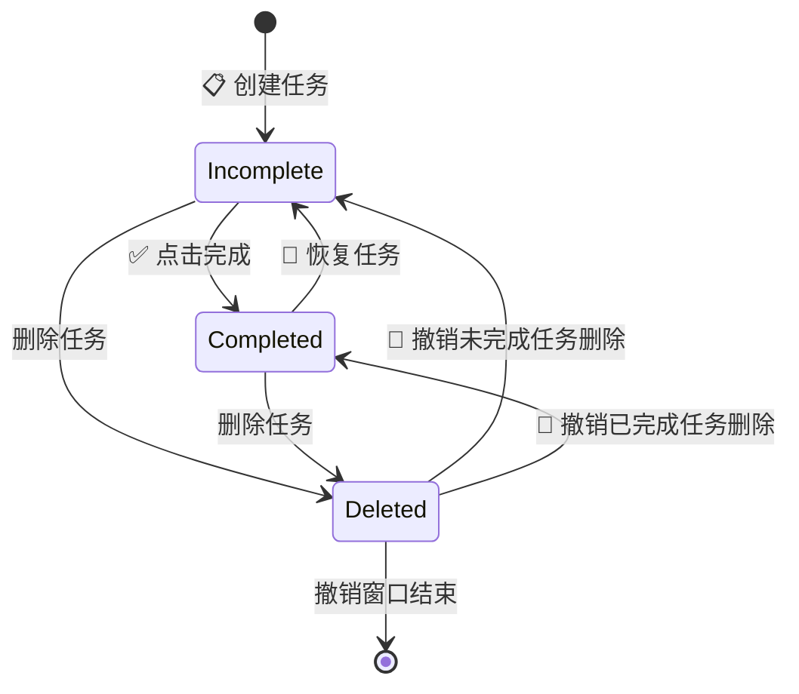
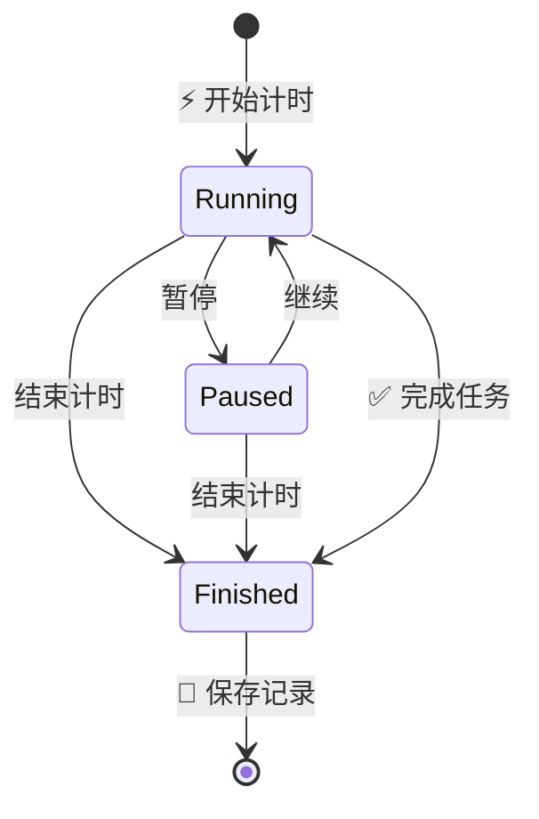
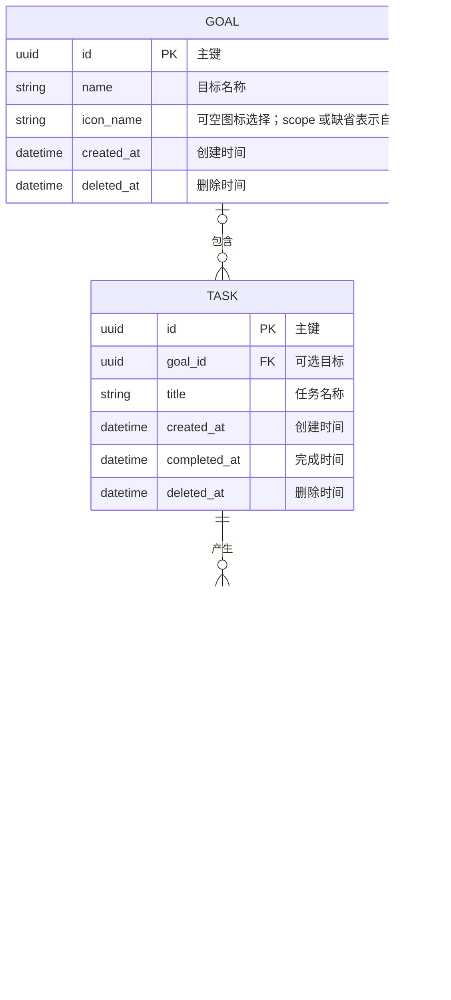

# 粥记产品需求文档 PRD

> 2026-09-30 用户确认外观与入口调整：采用榴榴手绘风格，四个入口为“今天、目标、日历、我的”。日历替代原记录页，按日期回顾已经发生的完成与计时事实；原 V3 记录页及蓝色视觉规则由本次规则取代。

_定义粥记 V1–V3 的产品行为、交互规则、数据口径和验收标准；产品行为以本文档为准。_

> 2026-09-11 范围增补：用户确认在 V3 基础上逐步增加 Apple / 微信登录与云同步，继续允许游客使用。下文 V1–V3 的账户排除项描述原始版本范围，不再限制本次增量；账户、后端和同步应分别完成验证后交付，未完成的能力不作为已上线功能展示。云同步规则与验收见 [云同步产品需求增量](05-云同步产品需求增量.md)。

### 游客数据提示

- 未登录仍可创建任务、目标并记录时间，数据继续由 SwiftData 保存于本机。
- “我的”页面显示“游客模式”及“数据仅保存在本机，尚未进行云同步。卸载 App 或更换设备时，数据可能丢失。”
- 不使用“未登录无法保存”的表述，不在启动时强制登录。
- 文案避免绝对化恐吓；在尚无可靠恢复能力时，可写「目前不能保证数据可恢复，建议导出备份」，不写「卸载一定丢失」作为唯一表述。
- 后续登录功能完成时增加登录入口；云同步实际完成后才显示同步成功，不将登录成功等同于数据已上传。

### Apple 登录增量（2026-09-12）

- “我的”提供系统 Apple 登录入口；不强制登录，不请求姓名和邮箱，使用 Apple 账户标识建立粥记账户。
- 服务端验证身份令牌、一次性请求与授权码后才算登录成功；取消授权继续保持游客状态。
- 登录凭据保存在本机钥匙串；过期或 Apple 授权撤销后清除登录状态，离线期间可继续使用本机任务。
- 登录成功明确展示“云同步尚未上线，任务与记录仍保存在本机”，不能展示同步成功。
- 退出登录只撤销当前设备会话；注销账户经二次确认后，先撤销 Apple 授权再删除服务端账户与全部会话。失败显示可重试提示，不假装成功；超过最近 10 分钟登录要求重新登录后注销。
- 任务、目标与计时仍仅保存在本机。现已区分游客与各账户的独立存储，退出返回游客记录；注销前保留账户内容副本，备份导出入口暂隐藏。详见下述本机隔离增量；云端同步与云端内容注销仍另行实现。
- 用户已确认本增量在真机正常登录与退出；注销路径已通过自动化验证，尚未进行真机人工验收。微信登录和云同步不在本次交付内。

### 账户昵称与头像（2026-09-12）

- “我的”首页展示当前登录用户的头像、昵称和较小的登录方式标识，点击头像或昵称可进入现有个人资料编辑；不以品牌名或固定榴榴插画代替用户资料。
- 修改并保存头像或昵称后，“我的”首页立即更新；取消编辑保留原资料。未登录时显示榴榴默认头像和“游客模式”；登录失效且仍打开账户本机记录时显示“账户记录 · 离线”，不展示其他账户资料。
- “我的”首页保留“我的概况”和“偏好设置”，去掉“日历回顾”按钮；日历从底部“日历”入口打开。
- 新账户及已有账户默认昵称为“粥记用户”，默认头像为榴榴；不自动读取 Apple 姓名或头像。首页、设置页与个人资料编辑中的默认头像保持一致，用户已选择的其他头像保留。
- 昵称去除首尾空白并进行 Unicode NFC 规范化，支持 1–20 个 Unicode 标量；拒绝换行、控制字符和隐藏方向字符。
- 提供榴榴、新芽、月夜、海浪、花开、远山六款内置头像。此阶段不上传相册图片，不接受远程头像地址。
- 保存成功后更新账户资料和本机缓存；再次登录、其他设备获取同一账户时读取已保存资料。任务与计时的云同步仍未上线。
- 保存失败保留编辑内容与原资料，可重试；取消不写入。登录失效时退出资料编辑，用户不能修改其他账户资料。

### 微信登录增量（2026-09-12）

- “我的”在游客态提供微信登录入口，与 Apple 登录并列；两者建立独立账户，不会静默合并。
- 微信授权使用官方 OpenSDK：请求 `snsapi_userinfo`，成功回调必须匹配 state，总授权时限 5 分钟。发起后 30 秒仍未离开 App，或从后台返回后 10 秒仍无授权结果，结束等待并给出重试提示；期间再次进入后台时取消返回等待，允许 SDK 验证跳转继续。取消或失败回调即使缺少 state 也结束等待，但绝不据此登录。未安装微信、取消授权或服务端失败时保持游客状态。
- Universal Link 域名与开放平台填写值保持一致；服务端 challenge 一次性，绑定 provider 为 `wechat`，避免与 Apple challenge 混用。
- 微信 refresh token 加密保存；会话仍只存 SHA-256。注销微信账户删除粥记账户与授权凭据，不调用微信撤销端点，并提示用户可在微信设置中管理应用授权。
- 用户已确认真机微信登录成功（2026-09-12）。退出、重新登录、注销与异常路径仍须分别记录验收结果；云同步仍未实现，登录成功不得暗示数据已上传。同步规则见 [云同步产品需求增量](05-云同步产品需求增量.md)。

### 云同步规则修订（2026-09-13）

云同步尚未实现。细则与验收矩阵见 [云同步产品需求增量](05-云同步产品需求增量.md)。R1–R5 已于 2026-09-13 全部确认：冲突保留双方并提示选择；软删除云端保留 7 天后物理清理；仅同步已结束计时；离线队列满额仍可本机使用；禁止跨账户直接恢复。待确认建议不能自动覆盖本 PRD 已有行为；实现开放前仍须完成服务端与真机验收。

本轮按“继续完善”请求补强本机 JSON 备份：导出固定时刻的副本，不改变现场计时；其中运行计时在恢复后暂停，只计到导出时刻。恢复前要求结束本机现有计时（含暂停），保留保护副本；校验或写入失败时回退本机数据。同 ID 按备份更新，其他本机记录保留。备份格式升级为 v2，兼容读取 v1。具体边界与验收见 [本机备份与恢复](06-本机备份与恢复.md)。本机分库行为见下节，云同步和灾备未完成；R5 中跨账户恢复部分仍待确认。

### 本机账户数据隔离（2026-09-13）

- 旧库保留为游客记录，不随已有登录身份自动认领。每个账户使用独立本机库；登录打开该账户记录，可在“我的”查看游客记录或返回当前账户记录，切换不合并数据。
- 退出返回游客记录；过期则保留原账户缓存及归属供离线使用，并提示重新登录。切换前须结束运行或暂停计时，失败保持原库。
- 列表、统计、计时、普通备份及恢复保护副本均随当前库隔离；备份仅允许恢复到同一归属，旧版未标记来源的备份仅在游客库恢复。
- 注销前保存账户内容副本，失败则不继续注销；成功后返回游客记录，副本保留在本机，导出入口暂隐藏。不能承诺当前已支持将注销副本恢复到另一个账户。
- 行为、文件保留与验收边界见 [本机账户数据隔离](07-本机账户数据隔离.md)。本增量不启用内容同步、不实现游客合并或跨账户导入。

### 本机备份入口暂隐藏（2026-10-01）

- 按用户要求，“偏好设置”暂不展示“数据备份”区域，包括“导出备份”“从备份恢复”“导出恢复前备份”及条件出现的“导出注销前备份”。
- 已有任务、目标、计时、历史副本与备份恢复底层实现保留；注销前自动保存本机副本的保护规则继续生效。页面提示不再引导用户使用已隐藏的入口。

### 五个二级页面外观更新（2026-10-02）

- 计时、偏好设置、我的概况、关于粥记和个人资料编辑按已确认设计使用奶油纸色、苔绿、陶土橙、丝网印刷颗粒及榴榴平面插画。固定标题与说明沿用小赖字体；昵称、任务数据和数值继续使用可读字体。
- 计时页展示任务名称与所属目标名称快照、真实有效时长和运行/暂停状态。绿色完整圆环仅作装饰，不表达倒计时或计划进度；底部固定暂停/继续及结束计时。“收起”和返回只关闭页面，结束只保存投入，不完成任务。
- 偏好设置顺序为用户资料、数据与存储/关于粥记、账户、记录库、退出/注销。数据与存储为只读行；游客、离线、账户切换提示及测试同步开关原有规则继续生效，不展示备份与外观切换入口。
- 我的概况使用三行统计，仍读取当前记录库的累计完成、本周真实投入及当前任务完成率，不采用设计示例的固定数字。
- 关于粥记展示抱心榴榴、品牌短句和当前应用版本。资料编辑展示所选头像与昵称、六款同风格内置头像及底部保存，头像的既有存储标识保持兼容；取消和失败不写入新资料。
- 小屏允许滚动；辅助功能字号隐藏装饰场景，统计行和头像网格调整排布。返回入口至少 44 点，固定返回区域使用纸色背景，滚动和键盘避让时正文不穿过返回入口；计时操作和资料保存保持可达，键盘出现时保存按钮位于键盘上方。

---

## 📋 文档信息

| 项目 | 内容 |
| --- | --- |
| 产品名称 | 粥记 |
| 产品类型 | 极简任务与目标记录工具 |
| 首发设备 | iPhone |
| 版本范围 | V1–V3 |
| 最低系统 | iOS 17 |
| 数据方式 | SwiftData 本地保存；任务/目标/计时尚未上云 |
| 当前阶段 | V1–V3 已实现；Apple / 微信登录已交付；云同步 R1–R5 已确认、客户端与服务端协议已实现且**默认关闭**，待生产部署与真机联调后开放 |

### 产品定位

> 一个不用规划时间、不用设置优先级，只关注“今天做什么、为什么做、实际做了多久”的极简 Todo App。

产品必须让用户无需注册、无需教程，首次打开后直接进入今天页面并创建任务。

### 版本范围

| 版本 | 核心能力 | 不包含 |
| --- | --- | --- |
| V1 | 今天、任务、基础计时 | 目标、日历页、账户、云同步 |
| V2 | V1 全部能力、目标、任务归属、自动进度 | 日历页、复杂项目管理 |
| V3 | V2 全部能力、记录与统计 | 专业分析、排行、AI |

## 📍 信息架构


```mermaid
flowchart LR
    accTitle: 粥记信息架构演进
    accDescr: V1 只有今天页面，V2 增加目标页面，V3 增加日历页面和本地我的页面。

    subgraph version_one ["V1"]
        today_one["📋 今天"]
    end

    subgraph version_two ["V2"]
        today_two["📋 今天"]
        goals_two["🎯 目标"]
    end

    subgraph version_three ["V3"]
        today_three["📋 今天"]
        goals_three["🎯 目标"]
        records_three["📅 日历"]
        profile_three["👤 我的"]
    end

    today_one --> today_two
    today_two --> today_three
    goals_two --> goals_three

    classDef primary fill:#dbeafe,stroke:#2563eb,stroke-width:2px,color:#1e3a5f
    classDef accent fill:#ede9fe,stroke:#7c3aed,stroke-width:2px,color:#3b0764
    classDef success fill:#dcfce7,stroke:#16a34a,stroke-width:2px,color:#14532d

    class today_one,today_two,today_three primary
    class goals_two,goals_three accent
    class records_three success
    class profile_three primary
```

### 导航规则

- V1 启动后直接进入今天页面，不显示底部导航
- V2 使用“今天、目标”两个一级入口
- V3 使用“今天、目标、日历、我的”四个一级入口；“我的”首屏展示用户头像与用户名（默认头像为榴榴）、“我的概况”和“偏好设置”两行菜单及装饰明信片。右上齿轮也进入偏好设置；本地统计在我的概况中读取，账户与记录库控件集中在偏好设置中，备份入口暂隐藏，关闭后回到我的页。日历从底部入口打开。收藏和情绪功能不在本次范围内。
- 每次冷启动默认进入今天页面
- App 不设置欢迎页、注册页或登录页

## ✍️ 今天与任务

### 页面目标

用户进入 App 后立即知道还有哪些事情没有完成，并能快速新增、完成或开始计时。

### 页面结构

页面从上到下包含：

1. 产品名称或简洁标题
2. 当前日期与“今天”标识
3. 未完成任务区
4. 当天已完成任务区
5. 添加任务入口

任务行包含：

- 左侧完成状态按钮
- 任务名称
- V2 起可选的弱化目标名称
- 右侧计时按钮

### 展示范围

- 未完成区展示所有未删除且未完成的任务，包括此前日期创建但尚未完成的任务
- 已完成区只展示设备本地自然日内完成的任务
- 前一天未完成的任务自然延续，不修改创建时间
- 不显示任务逾期天数，不使用逾期警告
- 已软删除任务不出现在任何日常任务列表中

### 排序规则

- 未完成任务按创建时间升序排列，新任务追加在未完成区末尾
- 已完成任务按完成时间降序排列，最近完成的任务排在前面
- 恢复任务后，它返回未完成区，并按照原创建时间参与排序

### 空状态

| 场景 | 表现 |
| --- | --- |
| 没有任何任务 | 桌边书写场景下方显示居中大加号与“记一件事”，点击进入新增任务；不另设空状态卡片 |
| 没有未完成任务且当天完成过任务 | 首屏复用无任务时的完整桌边插画、居中大加号与“记一件事”；提示改为“今天的事都完成了，给自己一点休息的时间。”。当天已完成任务保留在首屏下方，向下滚动可查看、恢复或删除；新增或恢复任务后返回任务列表布局 |
| 没有未完成任务且当天尚未完成任务 | 使用无任务时的首屏布局与“新的一天，从一件小事开始。”提示；此前完成的任务仍保留在历史事实中 |
| 没有当天已完成任务 | 不显示空的已完成分组 |

## ⚡ 新增任务

### 基本流程

1. 用户点击“添加任务”
2. 页面直接进入文本输入状态并弹出键盘
3. 用户输入任务名称
4. 用户点击“添加”或使用键盘提交
5. 新任务立即出现在未完成区末尾

新增页沿用浅纸色与复古丝网印刷风格：小赖字体标题、榴榴书写插画、细描边表单和陶土橙“添加任务”按钮。任务名称与目标选择由原生控件显示，不写入插画；键盘使用系统输入法。编辑时隐藏底部四页导航，将添加按钮固定在键盘上方；提交或返回后恢复导航。小屏和大字号允许表单滚动，较大字号隐藏装饰插画，保留输入与提交操作。清空名称后继续保持输入焦点；空白名称既不能用按钮添加，也不能通过键盘提交。

### 字段规则

| 字段 | V1 | V2–V3 | 规则 |
| --- | --- | --- | --- |
| 任务名称 | 必填 | 必填 | 去除首尾空白后不能为空 |
| 所属目标 | 不提供 | 可选 | 最多选择一个未删除目标 |

不提供描述、截止时间、优先级、标签、提醒、预计时长和颜色字段。

### 异常处理

- 输入为空或只有空白字符时，“添加”不可用
- 保存失败时保留用户输入并显示轻量错误提示
- 连续点击提交不得创建重复数据
- 取消新增时不保存内容

## ✅ 完成与恢复

### 完成任务

点击未完成任务左侧圆圈后：

- 立即设置完成状态和完成时间
- 将任务移动到当天已完成区
- V2 起立即更新所属目标进度
- V3 起立即更新当天和本周完成数量
- 不显示确认框

如果任务正在计时，完成操作先结束并保存当前计时，再完成任务。

### 恢复任务

点击已完成任务的完成标记后：

- 将任务恢复为未完成
- 清除原完成时间
- 将任务移回未完成区
- 立即回退目标进度和完成数量统计
- 不显示确认框

### 任务状态


```mermaid
stateDiagram-v2
    accTitle: 任务状态变化
    accDescr: 任务在未完成和完成之间切换，删除后从可见列表消失，撤销删除可回到删除前状态。

    [*] --> Incomplete: 📋 创建任务
    Incomplete --> Completed: ✅ 点击完成
    Completed --> Incomplete: 🔄 恢复任务
    Incomplete --> Deleted: 删除任务
    Completed --> Deleted: 删除任务
    Deleted --> Incomplete: 🔄 撤销未完成任务删除
    Deleted --> Completed: 🔄 撤销已完成任务删除
    Deleted --> [*]: 撤销窗口结束
```

业务上只向用户展示“未完成”和“完成”两种状态；删除是数据保留策略，不作为可见任务状态。

## ⏰ 任务计时

### 入口与显示

- 未完成任务右侧显示开始计时按钮
- 已完成任务不显示计时按钮；需要继续计时时应先恢复任务
- 计时页显示任务名称、已投入时长、当前状态和操作按钮
- “结束计时”和“完成任务”使用不同文案，避免语义混淆

### 计时流程


```mermaid
stateDiagram-v2
    accTitle: 任务计时状态变化
    accDescr: 一次计时可以在运行和暂停之间切换，结束后保存有效投入；被中断时通过持久化状态恢复。

    [*] --> Running: ⚡ 开始计时
    Running --> Paused: 暂停
    Paused --> Running: 继续
    Running --> Finished: 结束计时
    Paused --> Finished: 结束计时
    Running --> Finished: ✅ 完成任务
    Finished --> [*]: 💾 保存记录
```

### 计时规则

- 从零开始正向计时，不预设时长
- 只累计运行状态的有效秒数，暂停时长不计入
- 一次任务可以产生多次独立计时
- 同一次计时允许多次暂停和继续
- 全局最多存在一个运行中或暂停中的计时
- 结束计时仅保存投入，不自动完成任务
- 计时结果至少按秒保存，界面可以按秒或分钟友好展示

### 切换计时任务

当另一个任务存在未结束计时时，用户点击新任务的开始按钮：

1. 显示当前计时任务名称
2. 询问是否结束并保存当前计时，然后开始新任务
3. 确认后先保存旧计时，再启动新计时
4. 取消后继续原计时，不改变任何数据

不允许两个任务同时计时。

### App 生命周期

- 每次开始、暂停、继续和结束都立即持久化关键状态
- 运行状态下进入后台时，计时按真实时间继续
- 暂停状态下进入后台时，不增加时长
- App 被系统终止或用户重新打开后，根据持久化时间恢复状态和正确时长
- 设备时间变化时，以持久化时间点计算并避免产生负时长
- 保存失败时不得把尚未落盘的计时显示为已完成保存

## 🎯 目标

### 目标页面

V2 增加目标页面，每个目标显示：

- 目标图标
- 目标名称
- 自动计算的进度百分比
- 已完成任务数与任务总数

页面右上提供固定的陶土橙圆形加号，保留“新建目标”无障碍名称；滚动列表时入口仍可达。点击后展开名称输入区，创建或取消后恢复加号。目标用紧凑的图标、名称、完成/总任务数和箭头呈现，进度比例可在详情与无障碍朗读中读取。全部、进行中、已完成筛选收进标题旁的小菜单。删除目标后，该目标不再出现。

### 新建目标

创建目标时，目标名称是唯一必填字段，去除首尾空白后不能为空；图标默认“自动匹配”，按名称中的本地关键词推荐主题，例如高数对应学习、论文对应阅读、求职对应工作、iOS App 对应数字产品，未匹配时使用通用目标主题。创建后可在目标设置中选择具体图标或恢复自动匹配。不要求填写描述、截止时间、颜色、优先级、权重或 KPI。

### 目标详情

目标详情显示：

- 目标名称与自动进度
- 属于该目标的未删除任务
- “添加任务”入口；从此入口创建的任务自动归属当前目标
- “目标设置”入口；可以修改目标名称，并从内置图标中选择一个目标图标

点击目标后进入该目标的任务页，沿用暖色纸张、手写标题和榴榴阅读插画。顶部右侧进入目标设置；任务按未完成在前、已完成在后排列，支持勾选、计时、左滑删除与撤销。进度卡显示已完成/总任务数、百分比和进度条，空目标显示 `0/0` 与 `0%`。

任务页底部提供独立添加卡片：只输入任务名称，明确提示新任务自动归属当前目标。空白名称不能添加；添加成功后清空输入、收起键盘，任务列表与进度即时更新。输入期间保留底部四页导航并允许切换页面，导航与添加按钮均位于键盘上方、互不遮挡；切换页面时结束输入焦点，不自动提交任务。

添加任务时，目标页标题字号和阅读插画尺寸保持稳定，不随输入焦点或键盘弹出缩小；可用高度不足时通过任务列表滚动避让键盘，保留添加操作。

目标名较长时，页头和归属提示最多显示两行，避免挤占添加控件；无障碍朗读保留完整目标名称。

目标设置页使用独立的名称输入和内置图标网格，选中的图标显示勾选标记，顶部预览即时反映草稿。页面收起底部导航并保留返回与固定的“保存设置”按钮；名称为空或未改动时保存按钮不可用。保存后返回任务页；直接返回不保存草稿。小屏幕和大字号允许滚动，装饰插画为表单与任务让出空间。

设置保存后，目标列表和日历中的完成任务图标立即反映最新设置；历史计时明细继续使用名称快照。自动匹配随目标名称更新，用户已选择的具体图标优先保留；选择“目标”可固定使用通用主题。历史计时保存的目标名称快照不随目标重命名而修改；旧数据没有图标字段、仍为默认 scope 或包含无法识别的图标值时，按自动匹配显示，不回写已有数据。

V1–V3 不提供目标嵌套、子目标或手动调整百分比。

### 任务归属

- 一个目标可以包含多个任务
- 一个任务最多属于一个目标
- 新增普通任务时可以不选择目标
- 目标名称在今天页面作为弱化辅助信息，任务名称始终是视觉主体
- V1 不显示任何目标字段或入口

### 进度口径

```text
目标进度 = 已完成且未删除的任务数 ÷ 该目标下未删除的任务总数
```

| 场景 | 结果 |
| --- | --- |
| 目标没有任务 | `0%` |
| 添加未完成任务 | 分母增加，进度重新计算 |
| 完成任务 | 分子增加，进度立即更新 |
| 恢复任务 | 分子减少，进度立即更新 |
| 删除任务 | 从分子和分母中排除 |
| 删除目标 | 目标消失，任务保留并变为无目标 |

## 📅 日历回顾

### 页面目标

日历替代原“记录”一级入口，让用户按日期回看完成的小事和真实投入。进入时选中今天，默认展示当前月份。

### 展示与操作

- 月历按周日到周六排列，月份标题两侧按钮切换上个月、下个月；点击月份标题回到今天。
- 切换月份时保留选中日号，目标月份没有该日号则选中该月最后一天。
- 点击日期更新选中态和当天详情；今天有细描边，选中日期用陶土橙圆形标记。
- 有完成任务或有效计时的日期下方显示苔绿小点，VoiceOver 读出“有记录”；暂停但没有实际投入的日期不显示记录点。
- 首屏当天摘要展示日期、完成数量与有效投入总时长，野餐场景铺满下方宽度。点击摘要打开当天回顾，展示完成任务名称与完成时间，以及每次计时的任务名称快照、目标名称快照和当日有效时长；关闭后返回当前选中日期。
- 运行或暂停中的计时只在今天的详情中显示当前状态；历史日期显示该日的实际投入。
- 空状态显示“这一天还没有留下记录。从一件小事开始，也很好。”；数量显示零，不预置示例任务或打卡天数。
- 日历随当前本机库切换；“我的”继续保留累计完成、本周投入和完成率等真实概览。

### 时间与历史规则

- 采用设备当前本地时区，每日范围为当日 `00:00:00`（含）至下一自然日 `00:00:00`（不含）；月末与夏令时边界按系统 Calendar 计算。
- 完成任务按 `completedAt` 所在日期归属；恢复任务会清除完成时间，原日期数量与完成明细随之回退。
- 有效计时从 `activeIntervals` 与当前运行区间计算，跨午夜按日期拆分，暂停区间不计入；运行区间只计到当前时刻。
- 删除任务后保留已有完成历史与计时；删除目标后历史计时仍展示原目标名称快照。
- 不存储或回写累计统计，不新增日程、截止日期、提醒、习惯打卡、收藏或连续天数。

## 💾 数据模型


```mermaid
erDiagram
    accTitle: 粥记本地数据模型
    accDescr: 目标可以包含多个任务，任务可以产生多次计时；计时同时保存任务和目标快照以保证历史统计稳定。

    GOAL o|--o{ TASK : "包含"
    TASK ||--o{ TIMING_SESSION : "产生"

    GOAL {
        uuid id PK "主键"
        string name "目标名称"
        string icon_name "可空图标选择；scope 或缺省表示自动匹配"
        datetime created_at "创建时间"
        datetime deleted_at "删除时间"
    }

    TASK {
        uuid id PK "主键"
        uuid goal_id FK "可选目标"
        string title "任务名称"
        datetime created_at "创建时间"
        datetime completed_at "完成时间"
        datetime deleted_at "删除时间"
    }

    TIMING_SESSION {
        uuid id PK "主键"
        uuid task_id FK "任务引用"
        datetime started_at "首次开始时间"
        datetime ended_at "结束时间"
        data active_intervals "有效运行区间"
        int accumulated_seconds "有效秒数"
        datetime running_started_at "当前运行起点"
        string state "运行暂停或结束"
        string task_title_snapshot "任务名称快照"
        uuid goal_id_snapshot "目标标识快照"
        string goal_name_snapshot "目标名称快照"
    }
```

### 模型约束

- 所有标识使用稳定唯一值
- `Task.goalId` 可以为空
- `Task.completedAt` 为空表示未完成，非空表示完成
- `deletedAt` 非空的数据不出现在常规列表，但仍可供历史统计关联
- `TimingSession.activeIntervals` 按顺序保存每段连续运行的开始和结束时间，是跨日期统计的事实来源
- 当前正在运行的区间由 `runningStartedAt` 表示，暂停或结束时闭合并追加到 `activeIntervals`
- `accumulatedSeconds` 与全部已闭合区间时长之和保持一致，用于快速展示而不是替代区间事实
- `TimingSession` 的未结束状态只允许全局存在一条
- `TimingSession` 结束后不再修改其任务和目标快照
- V1 已创建 `Task` 和 `TimingSession`；V2 增加 `Goal` 及可选关系；V3 不改变计时事实数据

## 🔄 删除与数据保留

### 删除任务

- 使用左滑删除
- 删除后立即从列表消失
- 页面显示 5 秒撤销入口
- 撤销时恢复删除前的完成状态、完成时间和目标关系
- 撤销窗口结束后仍采用软删除，不物理清除计时历史
- 删除任务从目标当前进度的分子和分母中排除

### 删除目标

删除前显示确认信息：目标将消失，其中任务会保留，但不再属于该目标。

确认后：

- 目标被软删除并从目标页面消失
- 该目标下未删除任务的当前目标关系被清空
- 任务状态、完成时间和计时不改变
- 已结束计时中的目标快照不改变
- 正在进行的计时保留开始时的目标快照

### 数据清除边界

V1–V3 不提供回收站、批量删除、自动清理、账户注销或云端数据删除功能。

## 🎨 体验与视觉要求

### 视觉方向

- 以用户提供的手绘参考为准：奶油纸色页面、浅奶油卡片、苔绿正文与完成状态、陶土橙导航选中态和计时/新增操作，辅以少量暖黄色。
- 榴榴为圆形榴莲角色，苔绿外壳、浅黄面孔、棕色轮廓与粉橙腮红；今天使用桌边书写场景，目标使用旅行场景，日历使用阅读野餐场景，“我的”使用抱心形象。
- 页面标题与品牌短句使用随应用打包的小赖字体，任务内容与数据保留系统易读字体；纸纹轻量且静止，插画不参与点击和 VoiceOver。
- 底部导航使用通栏浅奶油底座与纯图标，保留完整无障碍名称；四个入口固定为今天、目标、日历、我的。
- 今天页无任务或全部完成时用居中大加号与“记一件事”作为主要入口；插画始终按页面宽度保持原始比例，添加、完成和恢复任务不改变插画及其上方文案的大小。插画的可见内容延伸到屏幕左右边缘，不能被任务列表的左右留白或圆角裁切，素材自身的透明边也不能形成可见空隙；任务卡片独立保留左右留白。有任务时列表允许滚动，右下新增入口及当前计时条保持可达。
- 今天和目标的新增操作使用陶土橙圆形加号，保留“添加任务”“新建目标”无障碍标签与足够点击区域。
- 目标卡片使用简洁苔绿图标与完成/总任务数；任务名称始终优先于辅助归属与插画。旅行场景铺满列表宽度。
- 全部页面固定使用参考图中的浅色纸张、圆角和文字层级，包括新增任务、目标详情、计时与设置；不跟随系统深色模式，不提供外观切换，旧深色偏好不再生效。
- 支持大字体；今天页在辅助功能字号下隐藏装饰插画，目标页隐藏装饰短句，我的页隐藏头像插画、短句与明信片，为实际操作让出空间。今天页在小屏上收紧加号和留白，保留完整插画比例，让“记一件事”完整处于底部导航上方；内容超过屏幕时允许滚动。列表保留悬浮控件与底部导航的避让区域；新增和关闭入口至少有 44 点点击区域。

### 操作反馈

- 完成、恢复和开始计时需要立即反馈
- 删除、保存失败和计时切换使用短而明确的提示
- 不为可安全撤销的轻量操作增加确认框
- 删除目标和切换正在计时的任务需要确认

### 可用性

- 支持动态字体；外观固定浅色纸张风格
- 交互控件具有足够点击区域和 VoiceOver 标签
- 关键状态不能只通过颜色区分
- 用户首次进入即可理解主要操作，不依赖教程

## 🚫 产品边界

V1–V3 明确不实现：

- 日程排布、截止时间、逾期状态和提醒（仅提供上述事实回顾日历）
- 优先级、标签、颜色分类和预计时长
- 多级项目、子任务、目标嵌套、OKR 和 KPI
- 复杂番茄钟、休息提醒和习惯打卡
- 社交、排行榜、协作和分享动态
- AI 自动拆解、分析或推荐
- 账户、登录、后端、网络依赖和云同步
- Widget、Apple Watch 和多平台客户端
- 复杂报表、热力图和专注评分

## 🧪 验收标准

### V1 验收

- [ ] 首次启动直接进入今天页面，无需登录或引导
- [ ] 只输入非空任务名称即可创建任务
- [ ] 点击一次可以完成任务，再次点击可以恢复
- [ ] 未完成任务跨天继续显示且无逾期提示
- [ ] 可以开始、暂停、继续和结束计时
- [ ] 暂停区间不计入有效时长
- [ ] 同一时刻不能运行两个任务计时
- [ ] App 中断后任务、完成状态和计时能够正确恢复
- [ ] 完成正在计时的任务会先保存计时
- [ ] 删除任务后可以在 5 秒内撤销
- [ ] 关闭并重新打开 App 后数据仍然存在

### V2 验收

- [ ] 可以只输入名称创建目标
- [ ] 可以在目标设置中修改目标名称和图标
- [ ] 新建目标和旧默认目标可以按名称显示推荐图标；无匹配时显示通用主题，且不回写旧数据
- [ ] 手动选择的具体图标不随名称推荐覆盖，可以恢复自动匹配
- [ ] 任务可以选择一个目标，也可以不选择
- [ ] 从目标详情新增的任务自动归属该目标
- [ ] 完成、恢复和删除任务后，目标进度立即正确更新
- [ ] 空目标显示 `0%`
- [ ] 删除目标需要确认，任务保留并变为无目标
- [ ] 删除目标不会改变历史计时快照
- [ ] 不使用目标功能时，V1 的快速新增流程保持不变

### V3 验收

- [ ] 今日完成数量按本地自然日计算
- [ ] 本周完成数量以周一为一周起点
- [ ] 今日和本周有效计时时长正确
- [ ] 跨午夜和跨周计时按边界正确拆分
- [ ] 按目标汇总的本周投入正确并按时长降序
- [ ] 无目标计时进入总时长但不进入目标排行
- [ ] 删除任务或目标后历史统计不减少
- [ ] 没有数据时显示清晰的零值或空状态
- [ ] V1、V2 已有交互保持不变

## 🔍 需求变更原则

新增或变更功能前必须确认：

1. 是否直接帮助用户回答三个核心问题之一
2. 是否会让普通任务创建变慢
3. 是否会增加新用户的学习成本
4. 是否能在不引入账户、后端和网络依赖的前提下完成
5. 是否具备明确版本归属和可验证的验收条件

不满足以上条件的功能不进入 V1–V3。
