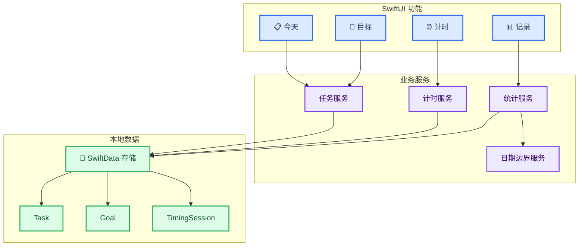

# 粥记 V1–V3 实施路线图

_将产品需求拆分为可交付的 iOS 版本增量，定义技术基线、数据演进、测试重点与完成标准。_

> 2026-09-11 新增迭代：在原 V1–V3 基础上，依次交付游客数据提示、后端基础服务、账户登录、云同步；每个功能独立验证、提交 Git 并推送。账户允许游客使用，登录后支持同步。本文后续“不引入后端或登录”的约束仅适用于原 V1–V3。用户已确认 Python + FastAPI + MySQL，数据访问使用 SQLAlchemy + PyMySQL。游客提示已交付，后端基础代码进入验证；MySQL 凭据、微信 AppSecret 与登录权限状态待补充，Apple 私钥配置暂缓。登录与同步尚未交付。

---

## 📋 实施目标

按照“今天 → 目标 → 记录”的顺序交付产品能力，同时保持以下约束：

- 下载后无需账户即可使用
- 所有核心数据保存在设备本地
- 普通任务始终只需输入名称即可创建
- 版本升级不能丢失任务、完成状态或计时历史
- V1–V3 不引入后端、网络权限或云同步

| 阶段 | 核心问题 | 主要交付 |
| --- | --- | --- |
| V1 | 今天做什么？ | 今天页面、任务、基础计时、本地持久化 |
| V2 | 为什么做？ | 目标、任务归属、自动进度 |
| V3 | 实际做了多久？ | 今日、本周和目标投入统计 |
| V3 后 | 是否需要旧系统？ | 基于真实设备数据进行兼容性评估 |

## ⚙️ 技术基线

| 项目 | 决策 |
| --- | --- |
| 开发语言 | Swift |
| UI | SwiftUI |
| 数据持久化 | SwiftData |
| V1–V3 最低系统 | iOS 17 |
| 首发设备 | iPhone |
| 架构方式 | 轻量分层、按功能组织 |
| 测试 | XCTest、SwiftUI UI Test |
| 网络 | 不使用 |
| 账户与服务端 | 不使用 |

### 架构原则

- SwiftUI 页面只负责展示和用户操作，不直接编写统计或计时计算
- 业务规则集中在可单元测试的服务中
- SwiftData 模型负责持久化事实，不把格式化文案写入模型
- 日期计算通过可替换的时钟与日历依赖完成，便于测试跨日和跨周场景
- 不提前引入通用框架、网络层、账户层或复杂依赖注入容器

### 模块关系

### 建议目录职责

| 分区 | 内容 |
| --- | --- |
| `App` | App 入口、导航和 SwiftData 容器 |
| `Features/Today` | 今天页面、任务输入、任务行 |
| `Features/Goals` | 目标列表、创建和详情 |
| `Features/Records` | 今日、本周和目标投入展示 |
| `Features/Timing` | 计时界面与切换确认 |
| `Domain` | 任务、计时、统计和日期边界规则 |
| `Data` | SwiftData 模型、Schema 和迁移计划 |
| `Tests` | 单元、持久化、迁移和 UI 测试 |

目录名称用于明确职责，实施时可以根据 Xcode 工程组织方式调整物理分组，但不得合并业务规则与页面展示职责。

## 💾 数据与迁移设计

### V1 Schema

V1 建立 `Task` 和 `TimingSession`，从首版开始保存可供 V3 统计的事实数据。

`Task` 至少包含：

- `id`
- `title`
- `createdAt`
- `completedAt`
- `deletedAt`

`TimingSession` 至少包含：

- `id`
- `taskId`
- `startedAt`
- `endedAt`
- `activeIntervals`
- `accumulatedSeconds`
- `runningStartedAt`
- `state`
- `taskTitleSnapshot`
- 可空的 `goalIdSnapshot`
- 可空的 `goalNameSnapshot`

`activeIntervals` 是由开始和结束时间组成的可编码值数组，不是第四个 SwiftData 主实体。开始计时或继续计时时打开新区间，暂停或结束时闭合并保存该区间。`accumulatedSeconds` 与已闭合区间之和同步更新，用于界面快速显示；跨日和跨周统计以区间事实为准。

计时的目标快照字段在 V1 保持为空，但从一开始存在，避免 V3 才重建计时历史。

### V2 Schema

V2 通过轻量迁移增加 `Goal`，并为 `Task` 增加可空目标关系。

`Goal` 至少包含：

- `id`
- `name`
- `createdAt`
- `deletedAt`

迁移后既有任务的目标关系为空；既有计时记录不修改。从 V2 起，新计时写入当时的目标标识和名称快照。

### V3 Schema

V3 优先通过查询和聚合已有数据实现统计，不新增可被事实数据推导出的累计字段，也不回写历史汇总值。

### 数据约束

- `id` 使用稳定唯一标识
- 任务标题和目标名称去除首尾空白后不能为空
- 全局最多存在一个 `state` 为运行或暂停的 `TimingSession`
- 已结束计时的 `endedAt` 必须存在，累计秒数不能为负
- 已闭合运行区间不能重叠，结束时间不能早于开始时间
- `accumulatedSeconds` 必须等于全部已闭合运行区间的秒数之和
- 软删除不级联物理删除计时历史
- 删除目标时，未删除任务解除关系；历史计时快照不改变
- 数据修改后立即保存，保存失败向界面返回明确结果

### Schema 演进

```mermaid
flowchart LR
    accTitle: 粥记数据模型演进
    accDescr: V1 建立任务和计时事实，V2 以可空关系增加目标，V3 直接聚合已有事实而不复制统计数据。

    v1["V1：Task 与 TimingSession"] --> v2["V2：增加 Goal 与可空关系"]
    v2 --> v3["V3：查询并聚合事实数据"]
    v3 --> evaluate["V3 后：评估旧系统兼容"]

    classDef primary fill:#dbeafe,stroke:#2563eb,stroke-width:2px,color:#1e3a5f
    classDef accent fill:#ede9fe,stroke:#7c3aed,stroke-width:2px,color:#3b0764
    classDef success fill:#dcfce7,stroke:#16a34a,stroke-width:2px,color:#14532d
    classDef neutral fill:#f3f4f6,stroke:#6b7280,stroke-width:2px,color:#1f2937

    class v1 primary
    class v2 accent
    class v3 success
    class evaluate neutral
```

## 🚀 V1：今天与计时

### 交付范围

- 创建 SwiftUI iPhone App，最低支持 iOS 17
- 配置 SwiftData 容器和 V1 Schema
- 实现今天页面、空状态和任务列表
- 实现新增、完成、恢复、左滑删除和 5 秒撤销
- 实现计时开始、暂停、继续、结束和任务切换确认
- 实现前后台及重启后的计时恢复
- 保证全部能力离线可用
- 完成基础深色模式、动态字体和 VoiceOver 支持

### 推荐实现顺序

1. 建立工程、数据容器和可测试的日期依赖
2. 完成 `Task`、`TimingSession` 与数据约束
3. 完成任务新增、列表、完成和恢复
4. 完成软删除、撤销和目标外的基础数据保留
5. 完成单计时器服务及持久化恢复
6. 完成计时页面、切换确认和任务完成联动
7. 补齐空状态、错误反馈、可访问性和 UI 自动化测试

### 实现要点

- 今天页面查询全部未删除的未完成任务，以及本地当天完成的任务
- 列表不得通过修改任务创建日期实现“跨天延续”
- 计时显示值由累计秒数和当前运行起点计算，不依赖持续在内存中自增
- 暂停或结束时闭合当前运行区间，继续时打开新区间
- 每次计时状态改变后立即持久化
- 完成运行中任务时，在同一业务操作中保存计时并设置完成时间
- 删除撤销需要保存任务删除前状态，5 秒后只关闭撤销入口，不物理清除数据

### 完成定义

- [ ] PRD 中所有 V1 验收项通过
- [ ] 无账户、网络或权限申请
- [ ] 冷启动可以立即看到任务并输入新任务
- [ ] 强制终止 App 后重新打开，计时结果仍正确
- [ ] 同时开始第二个任务不会产生并行计时
- [ ] 任务软删除不会删除历史计时
- [ ] 核心业务规则具备单元测试，主要流程具备 UI 测试

## 🎯 V2：目标与进度

### 交付范围

- 增加 `Goal` 模型和 V2 Schema 迁移
- 增加今天、目标两个一级入口
- 实现目标列表、新建目标和目标详情
- 实现目标设置页，支持修改名称和内置图标
- 新增任务时提供可选目标字段
- 从目标详情新增任务时自动归属当前目标
- 在今天页面弱化显示目标名称
- 实现目标进度自动计算
- 实现目标删除确认、任务解绑和历史快照保留

### 推荐实现顺序

1. 编写并验证 V1 到 V2 的轻量迁移
2. 完成目标创建、查询、设置更新和软删除服务
3. 完成目标列表与详情页面
4. 为任务新增流程加入可忽略的目标选择
5. 完成目标进度计算与任务状态联动
6. 完成删除目标后的任务解绑和历史验证
7. 回归 V1 全部任务与计时流程

### 实现要点

- 目标进度实时从未删除任务推导，不存储可变百分比
- 空目标返回 `0%`，避免除零
- 删除目标、完成任务、恢复任务和删除任务后统一重新查询进度
- 目标功能不应增加普通任务创建的必填步骤
- 新计时开始时写入当时的目标快照，旧计时不回填
- 目标图标使用可空字符串保存，旧数据为空时回退到 `scope`，避免破坏性迁移

### 完成定义

- [ ] PRD 中所有 V2 验收项通过
- [ ] V1 数据升级后任务和计时完整保留
- [ ] 不选择目标时，新建任务仍与 V1 一样快速
- [ ] 目标名称和图标修改后能够持久化，旧目标显示默认图标
- [ ] 完成、恢复和删除任务后目标进度正确
- [ ] 删除目标不会删除任务或改变历史计时
- [ ] V1 自动化测试继续通过

## 📊 V3：记录与统计

### 交付范围

- 增加今天、目标、记录三个一级入口
- 实现今日完成数与有效计时时长
- 实现本周完成数与有效计时时长
- 实现本周按目标汇总的投入排行
- 实现零值与无目标投入的展示规则
- 实现跨午夜、跨周和本地时区统计
- 验证删除任务或目标后的历史统计稳定性

### 推荐实现顺序

1. 完成日期区间与计时区间求交的纯业务函数
2. 完成今日和本周任务完成数量查询
3. 完成有效计时时长聚合
4. 完成目标快照分组与降序排列
5. 完成记录页面及空状态
6. 验证大批量本地数据下的查询与页面响应
7. 回归 V1、V2 全部行为和数据迁移

### 实现要点

- 统计以事实记录实时推导，不维护容易失真的累计缓存字段
- 跨时间边界的运行区间按与统计周期的交集计算
- 本周固定以设备本地时间的周一为起点
- 无目标计时计入总时长，但不伪造目标分类
- 删除后的任务和目标不出现在当前列表，但快照仍可用于历史汇总

### 完成定义

- [ ] PRD 中所有 V3 验收项通过
- [ ] 今日和本周边界测试覆盖不同时区与跨午夜场景
- [ ] 暂停区间不进入任何时长统计
- [ ] 删除任务或目标前后的历史总时长一致
- [ ] V1、V2 数据可以无损升级并正常统计
- [ ] V1、V2 自动化测试继续通过

## 🧪 测试计划

### 单元测试

| 模块 | 必测场景 |
| --- | --- |
| 任务 | 非空校验、完成、恢复、软删除、撤销、排序 |
| 计时 | 开始、暂停、继续、结束、运行区间闭合、切换任务、完成任务联动 |
| 计时恢复 | 运行中重启、暂停中重启、后台持续计时、设备时间异常 |
| 目标 | 空目标、进度变化、删除解绑、历史快照保留 |
| 日期 | 当天边界、周一边界、暂停后跨午夜、跨周、本地时区 |
| 统计 | 完成数量、有效时长、无目标时长、目标排序、软删除后稳定性 |

### 持久化与迁移测试

- 使用独立测试容器验证保存、关闭和重新加载
- 准备 V1 样本库，验证升级 V2 后任务和计时不丢失
- 准备 V2 样本库，验证 V3 查询能够读取旧数据
- 验证存在运行中计时时重启 App 的恢复结果
- 验证软删除数据不会被普通查询展示，但仍能参与历史统计

### UI 测试

- 首次启动直接新增任务
- 完成并恢复任务
- 左滑删除并在 5 秒内撤销
- 开始、暂停、继续和结束计时
- 尝试为第二个任务开始计时并取消或确认切换
- 新建目标并从目标详情添加任务
- 删除目标后确认任务仍存在
- 查看无数据和有数据的记录页面

### 回归原则

- V2 发布前完整执行 V1 测试集
- V3 发布前完整执行 V1 和 V2 测试集
- Schema 发生任何变化时重新执行全部迁移测试
- 修改日期或计时算法时重新执行全部统计边界测试

## ✅ 发布检查

每个版本发布前统一确认：

- [ ] 该版本 PRD 验收项全部通过
- [ ] 对应版本及此前版本自动化测试通过
- [ ] 从上一版本升级后数据无损
- [ ] 冷启动、前后台切换和异常终止后数据正确
- [ ] 无非必要网络请求、登录入口或系统权限
- [ ] 深色模式、动态字体和 VoiceOver 基础体验可用
- [ ] 空状态、错误提示和确认文案与 PRD 一致
- [ ] 新增能力没有增加普通任务的必填字段

## 🔍 V3 后旧系统兼容评估

旧系统兼容不属于 V1–V3 的实现范围。V3 稳定后再执行以下评估：

1. 收集可获得的真实设备系统版本分布
2. 评估目标旧系统带来的新增用户覆盖
3. 评估 SwiftData 替换、封装或迁移到兼容存储层的成本
4. 评估 UI、日期、测试矩阵和维护成本
5. 决定是否支持 iOS 16 或更早版本

在完成评估前：

- 不承诺具体旧系统版本
- 不提前引入 Core Data 双存储方案
- 不为假设中的兼容需求增加 V1–V3 复杂度

## 🚫 实施边界

本路线图不包含发布日期、工期、人力分配和商业化方案，也不包含账户、后端、同步、日历、优先级、提醒、AI、社交、Widget 或 Apple Watch 实现。

任何新增范围必须先更新[产品需求文档 PRD](02-产品需求文档-PRD.md)，补充版本归属和验收条件，再进入实施路线图。
