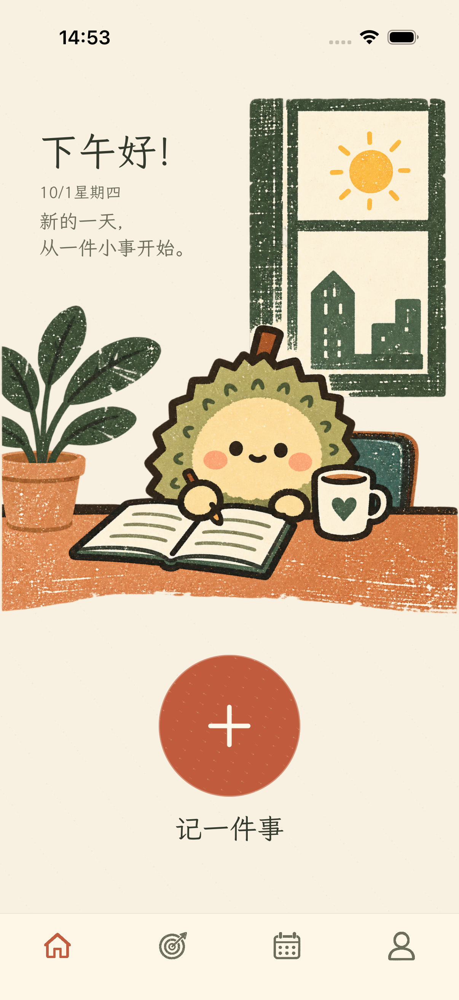
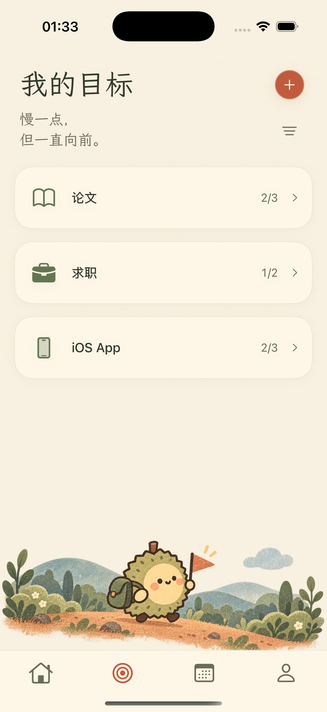
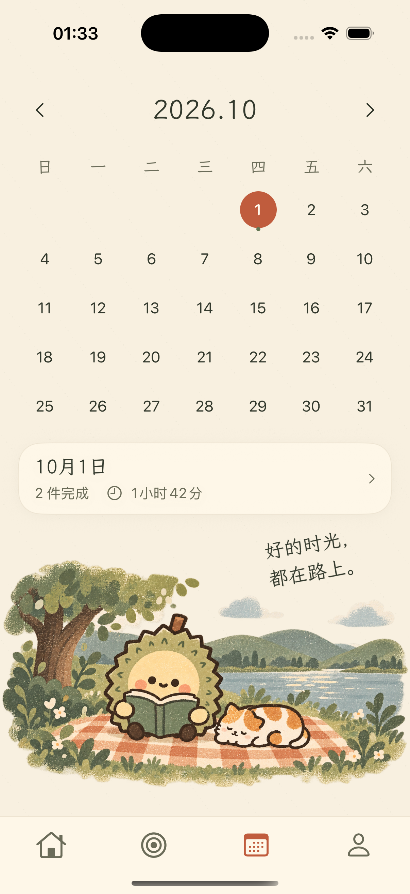
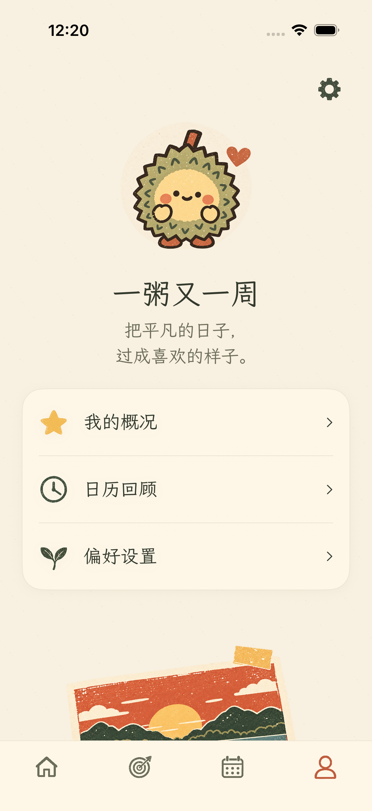

# 粥记 · 榴榴手绘改版

2026-09-30 用户确认采用手绘参考，入口为今天、目标、日历、我的；日历替代原记录页。品牌名仍为粥记，“一粥又一周”用于我的页文案。

## 实现范围

奶油纸色背景、轻纸纹、苔绿正文与进度、陶土橙操作与选中态。当前采用复古丝网印刷海报风与手绘平面插画，包括桌边书写、旅行、野餐阅读、榴榴头像与日落明信片。计时、任务与目标规则保留；日历只回顾实际发生的事实。完整规则见 PRD。

## 页面预览

今天页展示首次打开的空状态，其他页面使用临时示例数据；真实使用不会写入示例任务。

| 今天 | 目标 | 日历 | 我的 |
| --- | --- | --- | --- |
|  |  |  |  |

[今天页有任务时的布局](liuli-preview/today-with-tasks.png)

[今天页全部完成后的布局](liuli-preview/today-completed.png)

## 插画资源与制作说明

使用内置 imagegen 工具生成，资源位于 `ios/ZhouJi/Assets.xcassets/Liuli*.imageset/`。当前素材以用户提供的四页参考图与确认的「复古丝网印刷海报风 + 手绘平面插画」为准，实际接入说明见本文最后一节。以下为首版制作记录；未引入第三方软件库。

最终提示词集合：

- LiuliToday：wide 3:2 transparent iPhone header vignette; 榴榴 durian mascot with moss olive spiky shell, pale yellow face, short brown stem, dark brown pencil outlines, rosy cheeks, tiny hands and feet; writing in an open journal at a terracotta desk with a white green-heart mug, house plant, sunny green framed window. Vintage gouache and colored pencil risograph grain, cream/moss/terracotta, soft irregular transparent perimeter. No text, UI, panels or phone frame.
- LiuliGoals：same reference identity and medium; wide 3:2 transparent footer, 榴榴 walking along a terracotta trail with a moss backpack and terracotta pennant, layered sage and blue grey hills, leafy plants and cloud, airy negative space above, irregular transparent rim. No text, UI, panels or phone frame.
- LiuliCalendar：same reference identity and medium; wide 3:2 transparent footer, 榴榴 reading a sage book on a terracotta and cream checkered picnic blanket beside a sleeping orange and white cat, green tree, blue grey lake and moss hills. Irregular transparent edge. No text, UI, panels or phone frame.
- LiuliHeart：same reference identity and medium; square transparent front-facing full-body 榴榴 holding a terracotta red heart, joyful dot eyes and small curved smile, tiny floating heart, pale gold ground shadow, comfortable transparent padding. No writing, UI, panels or phone frame.

## 验证口径

验证以最终交付说明与实际测试结果为准。新增 CalendarFactsTests 覆盖月历排列、跨午夜、暂停、进行中计时、午夜归属和删除后历史。界面测试覆盖日期与月份切换、回到今天、完成与计时事实、任务目标闭环、主题及大字体。

2026-09-30 版本验证：82 项单元测试（15 个套件）、18 项界面测试均通过，通用模拟器构建通过（关闭代码签名）。

## 2026-10-01 逐页版式对齐

用户要求按页修正与参考图的差异，按今天、目标、日历、我的顺序修改并检查实际截图。

- 今天：没有待办时插画铺到两侧，居中大加号与“记一件事”直接进入现有新建流程；有待办时保留任务列表和右下新增。当天任务全部完成后，首屏复用无任务布局，只将提示改为“今天的事都完成了，给自己一点休息的时间。”；已完成列表位于首屏下方，滚动后仍能恢复或删除。新增或恢复任务后回到任务列表。小屏幕缩短场景高度，保证主入口和文案不被导航遮挡。
- 目标：新增固定在右上，筛选收进小菜单，卡片只显示图标、名称、完成/总任务数和箭头。旅行场景固定在下沿。辅助字号隐藏装饰短句，新增与取消流程保留。
- 日历：首屏显示月历、选中日期与当天事实摘要，完整野餐场景放在下方；点击摘要打开当天完成与计时明细，关闭后保留选中日期。时间与历史聚合规则不变。
- 我的：头像、三行轻菜单和装饰明信片。我的概况展示真实统计，日历回顾复用现有日历，偏好设置及右上齿轮承载账户、记录库与备份能力。辅助字号隐藏装饰元素，保留可滚动的实际菜单。
- 共用：图标导航、纸色和苔绿/陶土橙统一；小加号及自定义关闭按钮有至少 44 点的实际点击区域。

标题、品牌短句和固定菜单文案使用原样打包的 [霞鹜文楷](https://github.com/lxgw/LxgwWenKai)，任务名称和统计数据保持系统字体。字体与 OFL 1.1 授权文件位于 `ios/ZhouJi/Resources/Fonts/`；不依赖在线字体或外部服务。TTF 原文件约 24.3 MiB，SHA-256 为 `39ad71264b588165b469e35e6afb162a378dacd1f95348160240ba9038ac3009`。

本轮完整回归：82 项单元测试（15 个套件）与 19 项界面测试通过。末轮小屏幕布局和点击范围修正后，在 iPhone SE 模拟器补跑 5 项相关界面测试，覆盖首屏新增按钮完整可见并可打开、最大字号下目标滚动/取消、加号边缘点按、日历回顾关闭和关于页返回、深色大字体概况及计时中新增；全部通过。最终通用模拟器构建通过。上述预览由最终构建的模拟器 App 导出，未进行实机验证。

独立只读代码审查已复核最终截图、事实聚合、资料库切换与模态导航，未发现剩余阻塞问题；发现的紧凑屏幕文案遮挡及点击范围问题均已修正并补测。

## 2026-10-01 全部完成后的今天页

当天没有待办且已经完成过任务时，首屏与无任务布局一致，仅将提示替换为“今天的事都完成了，给自己一点休息的时间。”。已完成列表位于首屏下方；新增或恢复任务后返回普通待办布局。当天没有完成事实时仍显示原始开始文案，不把此前完成的任务算作今天的完成。

大加号使用持久的导航路径打开新建任务，避免列表给导航链接自动附加箭头并挤偏内容。任务完成、删除、撤销、计时和日期归属逻辑沿用现有实现。

验证：82 项单元测试与 iPhone 17 Pro 上 7 项相关界面回归通过；iPhone SE 上 3 项界面检查通过，其中完成状态测试额外覆盖已完成任务删除与撤销、再次新增和恢复。小屏截图与主预览均已检查，通用模拟器构建通过。独立只读审查未发现阻塞问题。本次未运行全部界面测试或实机验证。

## 2026-10-01 移除深色模式

用户明确不需要深色模式。全应用固定使用参考图的浅色纸张风格，包括四个一级页面、详情、新增、计时与设置；不跟随系统外观，旧的深色或跟随系统偏好不再影响显示。删除外观切换入口、深色配色和插画暗化分支。工程与运行入口都指定浅色，动态字体和 VoiceOver 继续保留。本条取代此前关于深色外观的设计要求；上文深色测试结果仅为历史记录。

验证：系统设为深色时，分别携带旧的深色与跟随系统偏好启动，四个一级页面、偏好设置和新增页截图均保持浅色纸张，外观入口不存在。82 项单元测试、5 项相关界面检查以及通用模拟器构建通过；独立只读审查确认原浅色配色数值一致，工程已无外观类型引用。未进行实机验证或全部界面回归。

## 2026-10-01 丝网印刷素材接入

用户确认「复古丝网印刷海报风 + 手绘平面插画」，并要求替换项目中的图片和图标。素材采用苔绿、陶土橙、奶油黄与灰蓝专色，保留手绘边缘、油墨漏白和颗粒。

- 接入 22 张透明 PNG：5 张场景与头像、17 个目标/导航/装饰图标。目标的自动推荐与手动选择继续使用原始存储值，由视图映射到对应手绘素材；学习、工作、数字产品、创作的图标也已补齐。
- 应用图标使用同一榴榴角色，在浅纸色底上生成，再按图标资源要求规范为 1024×1024 的不透明 PNG。
- 今天、目标、日历场景按完整构图等比显示。今天页将文字和插画上下排布，在固定首屏空间内自动分配插画高度，保证小屏完成提示与窗户留有间距。
- 我的页使用独立日落明信片，短句继续由页面排版。头像自带纸色圆形底，页面不再叠加第二层圆形背景。页面滚动后可查看完整明信片。
- 底部导航保留陶土橙选中态、菜单文字与 VoiceOver 标签。目标图标预览继续可被 VoiceOver 识别；任务、计时、日期归属与账户数据规则沿用原实现。

新增素材使用内置 imagegen 工具。完整提示词见 [丝网印刷提示词](2026-10-01-丝网印刷提示词.json)。资源文件位于 `ios/ZhouJi/Assets.xcassets/`，映射和显示组件位于 `Core/Design/ZJIllustration.swift`。未增加第三方依赖。

本节对应的四页预览及有任务、全部完成截图已更新为实际模拟器截图；上文各日期的测试结果为历史记录。

最终验证：iPhone 17 Pro 上 4 项界面测试通过，覆盖四页导航与任务操作、目标图标推荐/手动选择、全部完成后的新增和恢复、大字体下的页面入口；iPhone SE 上 3 项界面测试通过，覆盖四页导航、全部完成状态及设置/日历回顾入口。实际截图已检查，小屏完成提示与插画保持间距。22 张 PNG 的解码与透明通道检查通过，应用图标为 1024×1024、不含透明通道，通用模拟器构建通过。本轮为相关界面回归，未运行完整测试套件或实机验证。

## 2026-10-01 今天页参考构图修正

用户指出今天页与提供的单页参考仍有差异。本轮重新生成透明竖向桌边场景，采用左上留白、右上高窗、下半部榴榴与通栏桌面的构图，替换原先放在文字下方的横向场景。插画沿用复古丝网印刷海报与手绘平面风格，保留苔绿、奶油黄和陶土橙专色及油墨漏白颗粒。

问候语、当前日期和状态提示由页面在左上留白内排版，不烘焙到图片中。日期与分时问候继续实时显示；当天全部完成时仍只替换状态提示，完成记录保留在首屏下方。加号增大并增加同风格印刷颗粒。有任务时缩小完整构图，将空间留给任务列表。较大字体时隐藏装饰插画，文案全宽排版并继续支持滚动，避免文字与窗户重叠。

生成方式为内置 imagegen，图片位于 `ios/ZhouJi/Assets.xcassets/LiuliToday.imageset/LiuliToday.png`，提示词见 [今天页参考构图提示词](2026-10-01-今天页参考构图提示词.json)。仅调整今天页素材与排版，其他页面素材和任务、计时、目标、日期归属规则保持现有实现。

验证：iPhone 17 Pro 上 4 项界面检查通过，覆盖首次打开与新增、全部完成后的新增/恢复/删除/撤销、四页导航和任务操作、大字体；iPhone SE 上 3 项界面检查通过，覆盖首次打开与新增、全部完成后的操作及大字体。通用模拟器构建通过。新插画为 1145×1374、包含真实透明通道的 PNG；实际无任务、完成、有任务和小屏截图均已检查。首次打开测试还检查了左上提示与添加入口的可见性、间距和位置。未进行全部测试套件或实机验证。

本页今天相关预览已更新为本轮实际截图；另可查看 [小屏空状态](liuli-preview/today-se.png) 与 [小屏全部完成](liuli-preview/today-completed-se.png)。
