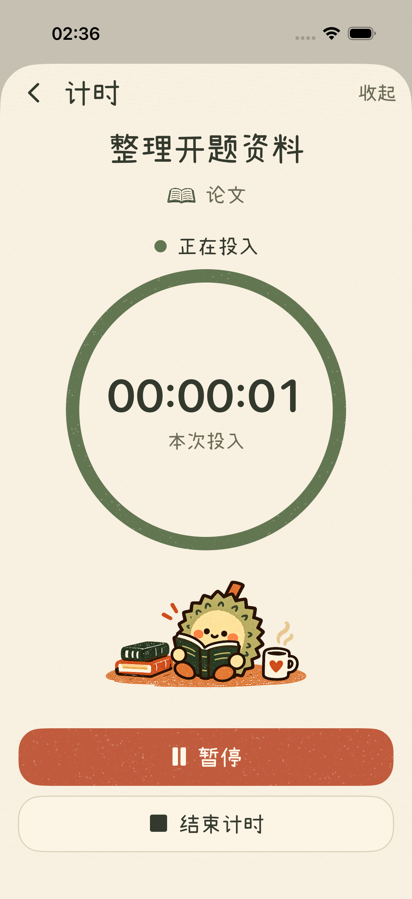
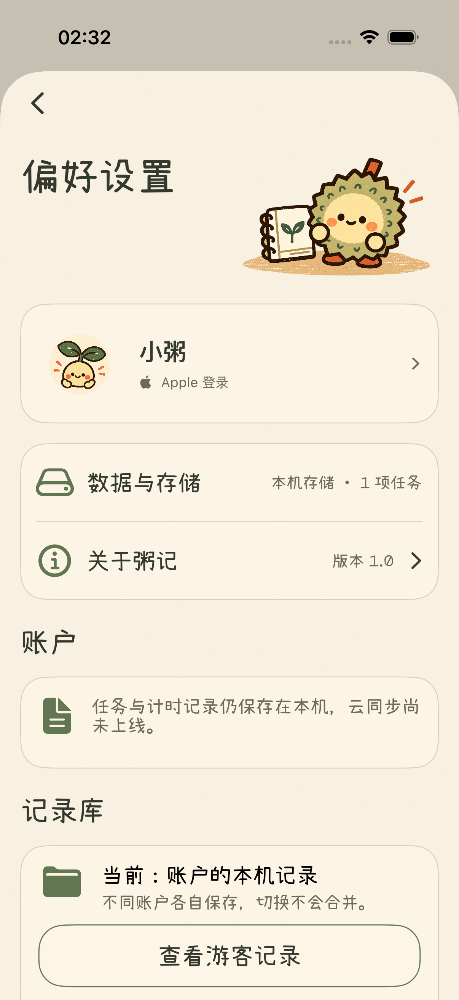
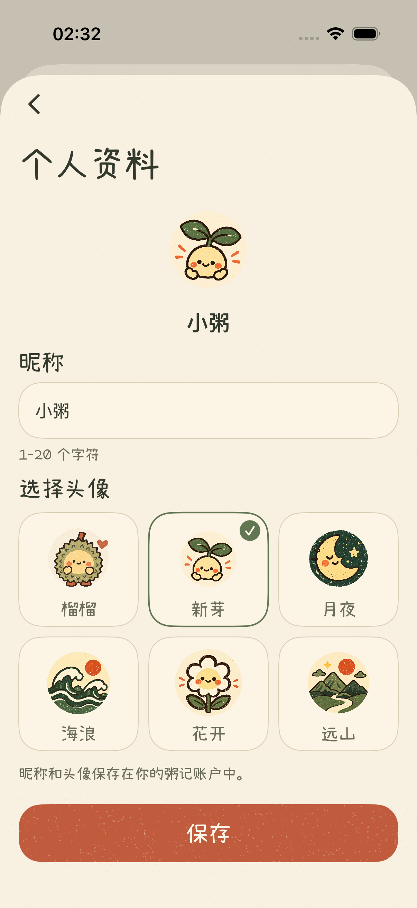
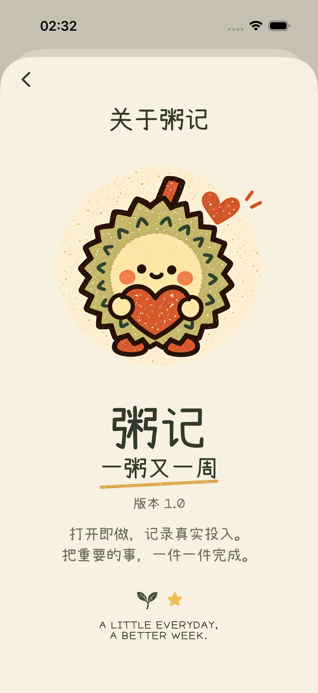

# 五个二级页面改版

按用户确认的 2026-10-02 设计改造计时、偏好设置、我的概况、关于粥记和个人资料编辑。页面采用奶油纸色、苔绿、陶土橙、手绘平面插画与固定的印刷颗粒。标题和固定文案使用已有小赖字体，数值和昵称使用系统字体。

## 页面与实现

| 页面 | 设计参考 | 实现要点 |
| --- | --- | --- |
| 计时 | [设计图](liuli-preview/timer-design-20261002.png) | 任务及目标名称快照、实际时长、完整装饰环、阅读插画，暂停/继续和结束固定在底部；收起不结束计时 |
| 偏好设置 | [设计图](liuli-preview/preferences-design-20261002.png) | 标题插画、实际用户卡、只读存储行、关于入口、账户与记录库、底部退出/注销；保留游客登录、离线和测试同步状态 |
| 我的概况 | [设计图](liuli-preview/overview-design-20261002.png) | 三行统计读取当前记录库，底部阅读与绿植插画；不使用设计图的演示数字 |
| 关于粥记 | [设计图](liuli-preview/about-design-20261002.png) | 抱心榴榴、粥记品牌、一粥又一周、运行中版本号和产品短句 |
| 个人资料 | [设计图](liuli-preview/profile-editor-design-20261002.png) | 真实昵称与头像、六款同风格头像卡片、底部保存；支持键盘与大字体，取消不写入 |

二级界面沿用已有弹层呈现，顶部状态栏和弹层形状由系统控制。小屏和辅助功能字号可滚动，装饰插画为实际内容让出空间。设计图中的示例账户和统计由当前用户内容替换。

## 实际截图

下列为自动化测试中的实际应用截图。演示账户选用了“新芽”，默认账户头像仍为榴榴。

| 计时 | 我的概况 |
| --- | --- |
|  |  |

| 偏好设置 | 个人资料 |
| --- | --- |
|  |  |

## 小屏与最大字号

- [小屏计时](liuli-preview/secondary-timer-running-se-20261002.png)
- [小屏概况](liuli-preview/secondary-overview-se-20261002.png)
- [小屏偏好设置](liuli-preview/secondary-preferences-se-20261002.png)
- [小屏个人资料](liuli-preview/secondary-profile-editor-se-20261002.png)
- [小屏关于](liuli-preview/secondary-about-se-20261002.png)
- [最大字号概况](liuli-preview/secondary-overview-large-se-20261002.png)
- [最大字号偏好设置底部](liuli-preview/secondary-preferences-large-se-20261002.png)
- [最大字号与键盘保存](liuli-preview/secondary-profile-keyboard-large-se-20261002.png)
- [最大字号计时](liuli-preview/secondary-timer-large-se-20261002.png)

## 素材与兼容

通过内置 `image_gen.imagegen` 工具，以五张已确认设计为参考，生成 4 张场景插画和 5 张头像：`LiuliTimer`、`LiuliPreferences`、`LiuliOverview`、`LiuliAbout`、`AvatarLeaf`、`AvatarMoon`、`AvatarOcean`、`AvatarFlower`、`AvatarMountain`。全部为带真实透明通道的 PNG，原始生成文件保留。

默认榴榴头像继续使用 `LiuliHeart`，六款头像的存储标识仍为 `sunrise`、`leaf`、`moon`、`ocean`、`flower`、`mountain`，已有资料无需迁移。提示词与来源见 [素材记录](2026-10-02-二级页面素材提示词.json)。未增加第三方依赖。

共用视觉控件位于 `Core/Design/ZJPrintedControls.swift`；其余修改集中在 `Features/Timing/TimerSheet.swift` 与 `Features/Profile/`。计时条补充完整矩形点击区域，使暂停后收起的计时可以从条中间重新打开。

## 验证

- iPhone 17 Pro 模拟器完整回归：82 项单元测试、33 项界面测试全部通过。
- 最后的计时页最大字号文字调整后，再次通过 82 项单元测试及 2 项计时界面测试；iPhone SE 同样通过这 2 项计时测试。
- iPhone SE 通过五页导航与真实数据、最大辅助功能字号、键盘出现时保存资料等 4 项针对性界面测试。计时圆环可以完整滚动到按钮上方，暂停、收起后重新打开、继续和结束均已验证。
- 最终模拟器构建通过，差异格式检查通过；独立代码审查未发现重要问题。

截图均直接从模拟器测试导出，未进行真机验收。截图、素材校验值及测试结果来源见 [验证记录](liuli-preview/secondary-pages-implementation-20261002.json)。
