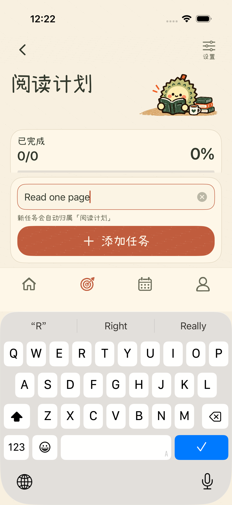
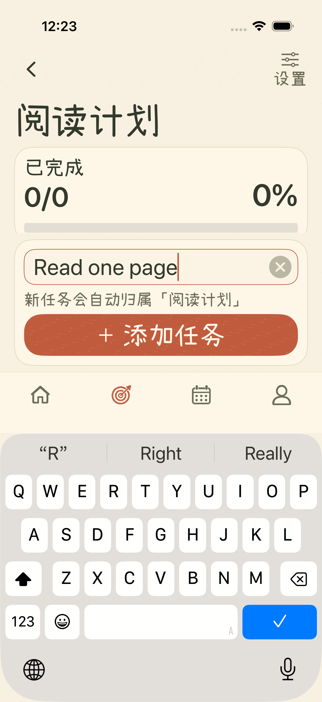
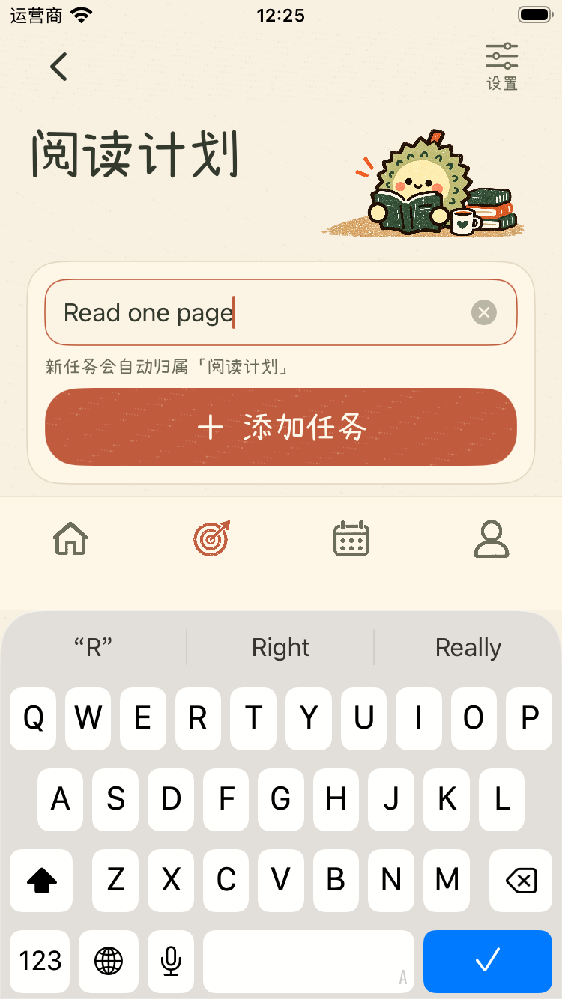
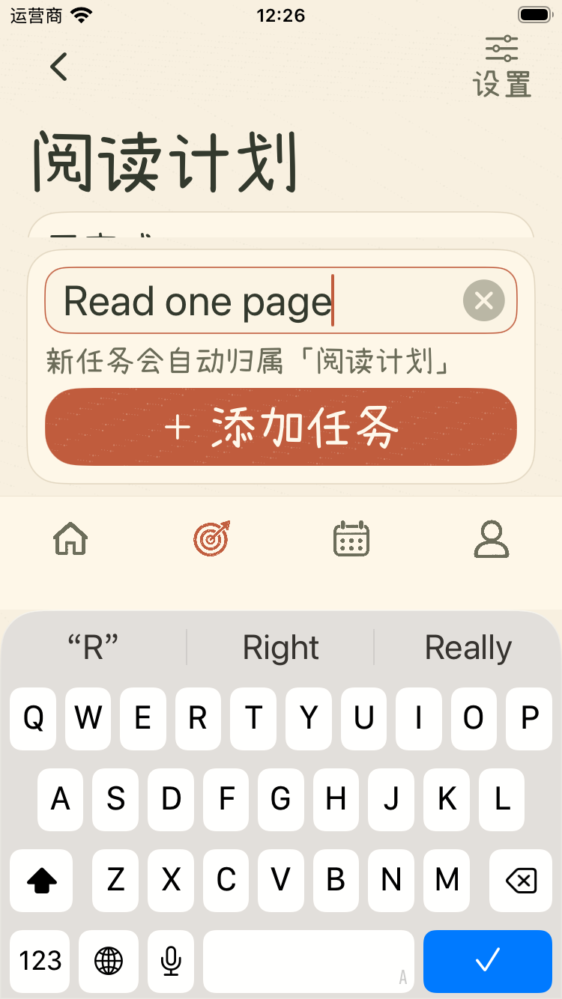

# 目标页输入时保留底部导航

按用户要求，目标任务页的原地添加任务不再隐藏底部四页导航。输入框、添加按钮与导航入口共同避让键盘，可以在输入期间切换页面。

移除由输入焦点传递到根导航的隐藏状态和绑定。离开目标页时结束输入焦点，不自动创建任务；返回当前目标可继续编辑草稿。正常添加后清空输入、收起键盘并更新实际任务与目标进度。此前的标题和插画字号稳定规则继续生效。

主要修改：

- [RootTabView.swift](../../ios/ZhouJi/App/RootTabView.swift)：目标任务输入不再触发隐藏导航。
- [GoalsView.swift](../../ios/ZhouJi/Features/Goals/GoalsView.swift) 与 [GoalDetailView.swift](../../ios/ZhouJi/Features/Goals/GoalDetailView.swift)：移除无须传递的输入状态绑定，保留焦点收起与任务逻辑。
- [ZhouJiV2UITests.swift](../../ios/ZhouJiUITests/ZhouJiV2UITests.swift)：新增普通字号与辅助功能字号下导航可见、可切换、继续编辑及实际创建任务的回归检查。

## 实际截图

iPhone 17 Pro：

| 普通字号输入 | 辅助功能字号输入 |
| --- | --- |
|  |  |

iPhone SE（第三代）：

| 普通字号输入 | 辅助功能字号输入 |
| --- | --- |
|  |  |

## 验证

新增测试先在旧实现上因导航入口不存在而失败；修复后通过普通字号与辅助功能字号两种流程，实际检查导航可点击、按钮位于键盘上方、切换时收起键盘、返回保留草稿，以及添加后的任务与进度。

- iPhone 17 Pro 完整回归：82 项单元测试（15 个测试组）与 35 项界面测试全部通过。
- iPhone SE（第三代）：5 项目标页专项界面测试通过，覆盖输入导航、标题字号稳定、任务与设置、长目标名称、大字号。
- 通用 iOS 模拟器构建通过。
- 独立只读代码审查未发现需修复的问题；任务归属、草稿与焦点处理保持正确。

截图直接从模拟器测试导出，未进行真机验收。测试结果与截图校验值见[验证记录](liuli-preview/goal-navigation-validation-20261002.json)。
