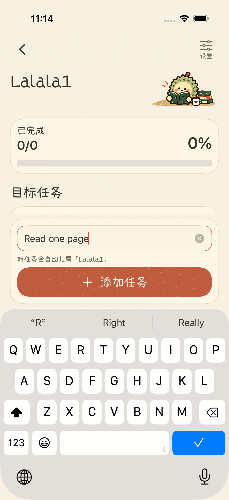
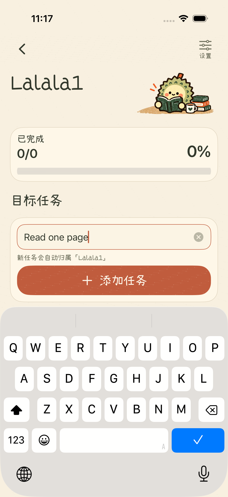
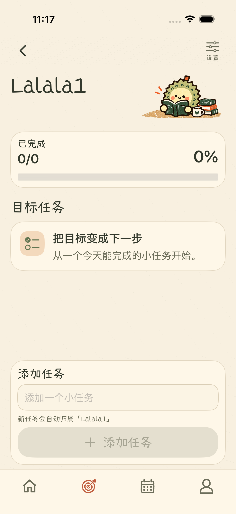
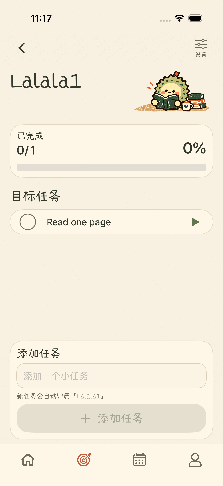

# 目标页输入时字号稳定性修复

用户在目标下添加任务时，目标名称与阅读插画会突然变小。旧布局在输入框获得焦点或列表高度小于 420 点时进入紧凑模式，标题基础字号从 36 变成 30，插画宽度从 150 变成 124。

目标任务页已移除这条紧凑布局切换。输入焦点和键盘不再改变标题字号或插画尺寸，可用高度变小时由原有任务列表滚动避让。字体仍支持系统文字大小；底部添加按钮继续位于键盘上方，任务自动归属当前目标，添加后恢复导航。

修改集中在 [GoalDetailView.swift](../../ios/ZhouJi/Features/Goals/GoalDetailView.swift)，回归测试位于 [ZhouJiV2UITests.swift](../../ios/ZhouJiUITests/ZhouJiV2UITests.swift)。目标设置页与其他页面布局未调整。

## 实际截图

| 修复前：输入任务时 | 修复后：输入任务时 |
| --- | --- |
|  |  |

| 修复后：输入前 | 修复后：添加完成 |
| --- | --- |
|  |  |

小屏验证：[输入任务](liuli-preview/goal-task-size-during-input-after-fix-se-20261002.png)、[大字号输入](liuli-preview/goal-tasks-large-text-keyboard-after-fix-se-20261002.png)、[长目标名称输入](liuli-preview/goal-long-name-keyboard-after-fix-se-20261002.png)。

## 验证

新增真实界面测试先在旧实现上复现失败，原因是输入后标题区域高度缩小；修复后测试通过。测试比较输入前后标题尺寸，并检查键盘上方的添加按钮、实际任务创建与进度更新。

- iPhone 17 Pro 模拟器完整回归通过：82 项单元测试、34 项界面测试，无失败。
- iPhone SE 模拟器 4 项目标页针对性测试通过，覆盖输入前后标题尺寸、键盘上方添加、长目标名、大字号及目标设置保存。
- 独立只读代码审查未发现本次修复引入的缺陷，差异格式检查通过。

以上截图直接从模拟器导出，未进行真机验收。截图校验值与测试来源见 [验证记录](liuli-preview/goal-input-size-validation-20261002.json)。
