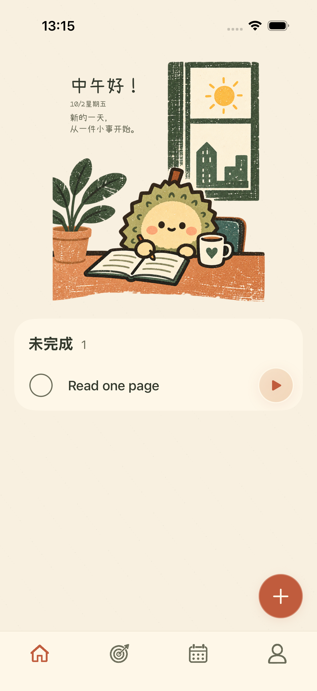
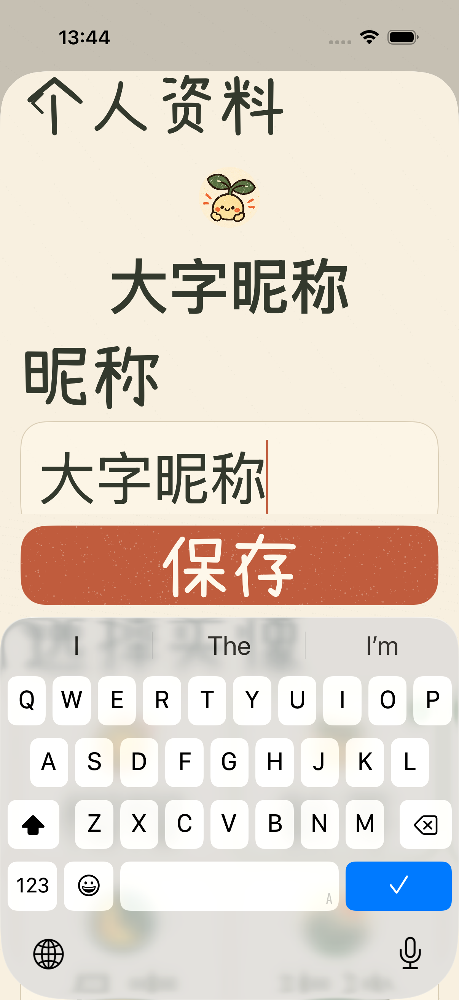
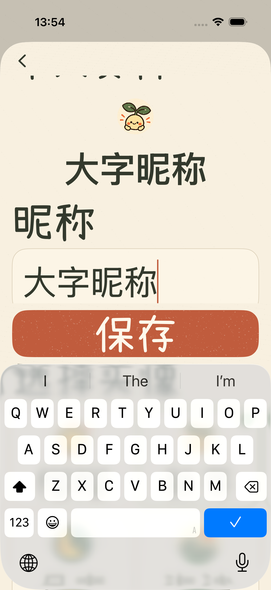

# 页面检查与首页插画修复

首页添加任务后，桌边书写插画和问候文字会一起缩小。本次修复统一空状态、有未完成任务、全部完成和恢复任务后的插画比例，并检查各主页面及二级页面的布局、导航和键盘交互。

后续用户复核发现：本轮恢复了图片比例，但有未完成任务时，列表仍裁掉图片两侧各 18 点。该遗漏已在[首页插画贴边修复](2026-10-02-首页插画贴边修复.md)中进一步修正；下文截图保留为本轮原始验证记录。

## 修复内容

1. **首页插画保持大小。** 原实现把有任务时的场景限制在 325 点高，并按该高度反推图片宽度，导致图片和文案约缩小到原来的三分之二。现在插画按页面宽度及素材原始比例排布，文案跟随实际图片宽度；任务状态不再影响图片大小。
2. **小屏加号与文案完整显示。** 普通屏幕保留 124 点圆形加号；空间紧张时使用 84 点圆形加号并收紧留白，保留插画比例。超出屏幕的列表可滚动，底部导航及新增入口保持可用。辅助功能大字号继续隐藏装饰插画。
3. **资料与设置返回区保持清晰。** 资料编辑、我的概况、偏好设置、关于粥记的固定返回区补齐纸色背景，滚动及键盘避让时正文不再穿过返回按钮区域。计时、头像、昵称和真实统计的行为保持原规则。

## 首页对比

添加任务前后采用相同的默认字号。修复前有任务时场景会变窄；修复后各任务状态保持同一比例。

| 修复前：有未完成任务 | 修复后：有未完成任务 |
| --- | --- |
|  |  |

| 无任务 | 全部完成 | 小屏无任务 |
| --- | --- | --- |
|  |  |  |

## 大字号资料编辑对比

| 修复前 | 修复后 |
| --- | --- |
|  |  |

## 逐页检查范围

| 页面 | 核对内容 |
| --- | --- |
| 今天 | 无任务、添加任务、完成全部任务、恢复任务，插画与文案比例，新增入口与计时条 |
| 目标 | 目标卡片与插画、滚动后的新建入口 |
| 目标任务 | 目标进度、任务归属、添加与恢复；输入时底部导航可用 |
| 目标配置 | 图标与名称修改、保存与返回，小屏及大字号操作 |
| 新建任务 | 键盘、取消、添加、目标归属，大字号操作 |
| 日历 | 月份和日期切换、返回今天、完成及计时事实展示 |
| 我的 | 用户头像与昵称、真实统计、资料及设置入口 |
| 计时 | 运行与暂停、结束与收起，所属目标名称和真实投入 |
| 我的概况 | 三行真实统计、返回，大字号排布 |
| 偏好设置 | 资料及关于入口、账户和记录库切换，大字号返回 |
| 关于粥记 | 插画、版本信息、完成与返回 |
| 个人资料编辑 | 头像、昵称、保存与取消，大字号键盘和返回区域 |

## 验证

本次使用 iPhone 17 Pro 和 iPhone SE 第三代、iOS 26.5 模拟器，未进行真机验收。测试结果及截图来源保存在[验证清单](liuli-preview/page-audit-validation-20261002.json)。

| 验证 | 实际结果 |
| --- | --- |
| 单元测试 | 82 项、15 个套件全部通过 |
| iPhone 17 Pro 整套界面测试 | 37 项全部通过 |
| 最终小屏加号调整后的 Pro 首页补验 | 首次首页与任务状态切换 2 项通过 |
| iPhone SE 小屏专项 | 首页、任务输入、资料及大字号流程 8 项通过，分为 5 项和 3 项两次运行 |
| 通用模拟器构建 | 最终源码构建成功 |

首页专项覆盖无任务、添加任务、全部完成和恢复，比较问候文案的高度与横向位置，以验证插画缩放一致；返回区专项检查键盘出现后可取消、可保存，并确认滚动正文不穿过返回区域。小屏新增入口检查同时确认按钮足够大、可点击，并完整位于导航按钮上方。

新增首页任务状态切换回归及大字号返回区截图检查；两项检查均先复现旧实现的问题，再验证修复。只读代码复核未发现需阻止交付的问题；PRD 中原先“有任务缩短场景”和“按可用高度收缩插画”的规则已同步修正。

## 关键文件

- `ios/ZhouJi/Features/Today/TodayView.swift`：按宽度保持插画比例，小屏新增入口留白。
- `ios/ZhouJi/Features/Profile/ProfileEditor.swift`：资料编辑返回区背景。
- `ios/ZhouJi/Features/Profile/ProfileView.swift`：概况、偏好设置和关于返回区背景。
- `ios/ZhouJiUITests/ZhouJiV2UITests.swift`：首页状态切换与返回区域回归检查。
- `docs/02-产品需求文档-PRD.md`：同步首页比例及返回区要求。
