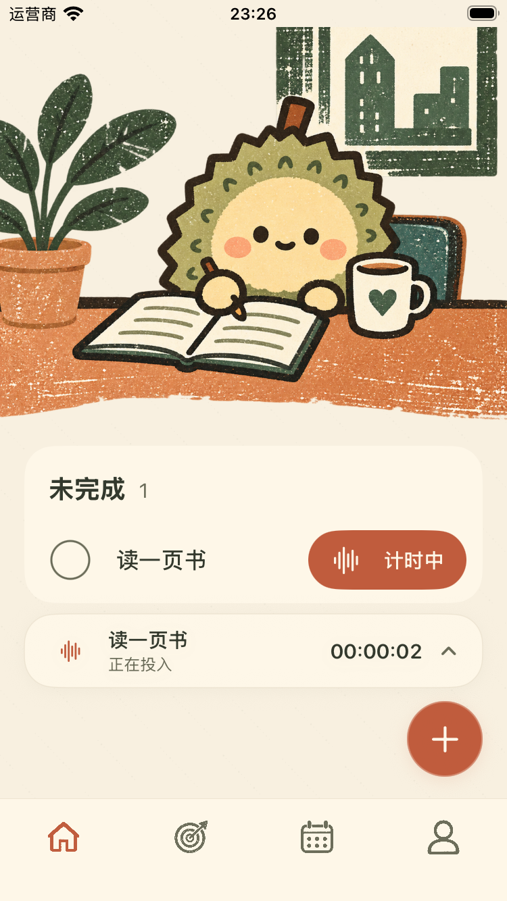
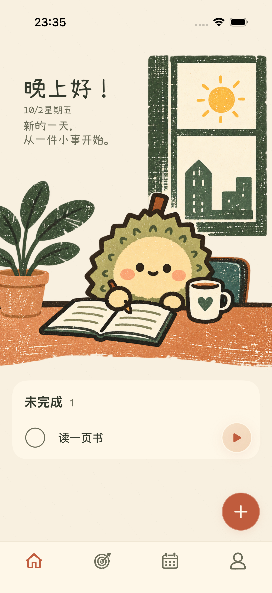
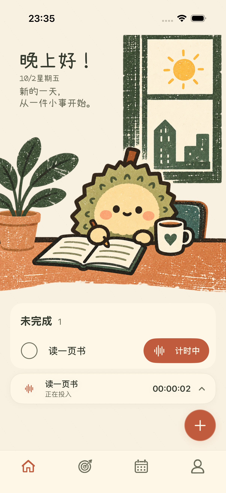

# 首页任务遮挡修复

小屏首页添加一项任务后，右下新增按钮覆盖任务的播放按钮。本轮将列表和底部控件分开布局，并在页面返回、计时收起及可用高度改变后定位单个未完成任务，使任务操作完整可见。

## 行为

- 任务列表、计时条、新增按钮、撤销提示和底部导航各占独立空间，不再通过覆盖列表来显示底部控件。
- 只有一项未完成任务时，返回首页和收起计时会定位到该任务；已有当天完成记录时也适用。多任务列表允许正常滚动，不自动定位。
- 全部完成后回到完整桌边插画和“记一件事”首屏。完成记录保留在首屏下方，仍可查看、恢复、删除及撤销。
- 插画沿用原来的尺寸、横向比例和两侧贴边处理。小屏通过纵向滚动显示任务操作，顶部问候可以向下拖回查看；不保证问候始终处于相同的屏幕纵向位置。
- 滚动内容裁到实际列表区域，状态栏保持纸色背景。没有底部控件时不预留空的控件高度。

## 小屏实测

下图来自 iPhone SE 第三代、iOS 26.5 模拟器的通过测试，未经修图。

| 修复前：新增按钮覆盖播放按钮 | 修复后：任务与新增入口分开 |
| --- | --- |
|  |  |

| 收起计时后 | 全部完成后 |
| --- | --- |
|  |  |

## 常规屏幕实测

| 一项任务 | 收起计时后 |
| --- | --- |
|  |  |

## 验证

新增单任务界面回归先在旧实现失败：播放按钮与新增按钮的实际矩形相交。修复后检查无需手动滚动即可开始计时、收起后任务和计时条仍可操作、结束后可以再次计时，以及各控件互不重叠。

可用高度的变化也需要参与定位：保存任务后底部导航恢复，列表高度随后改变，仅在数据变化时发出定位不能保证任务可见。最终实现同时响应单任务变化与实际列表尺寸变化，并在执行前确认目标仍有效。

恢复任务后，原生滚动条会短暂覆盖右侧内侧采样列。边缘检查最多等待三秒，要求同一张截图中全部采样列共同达标；仍包含最外侧第零列，保持原来的墨色阈值，持续裁切或留白仍会失败。

| 验证范围 | 结果 |
| --- | --- |
| SE 首页专项 | 6 项通过：首次打开、全部完成及再新增/恢复/删除撤销、运行中新增、单任务计时、插画比例与两侧最外像素、大字号 |
| iPhone 17 Pro 完整回归 | 82 项单元测试、38 项界面测试全部通过，无失败或跳过 |
| 通用模拟器构建 | 通过 |

最终完整回归和截图来源记录见 `liuli-preview/home-controls-validation-20261002.json`。未执行真机及 iOS 17 运行时验收。

## 关键文件

- `ios/ZhouJi/Features/Today/TodayView.swift`：稳定列表、独立底部控件、单任务定位、全部完成回顶及视口裁切。
- `ios/ZhouJiUITests/ZhouJiV2UITests.swift`：新增实际遮挡回归，既有多任务及插画检查按可滚动视口操作。
- `docs/02-产品需求文档-PRD.md`：同步底部控件分区、单任务可操作和全部完成首屏规则。
