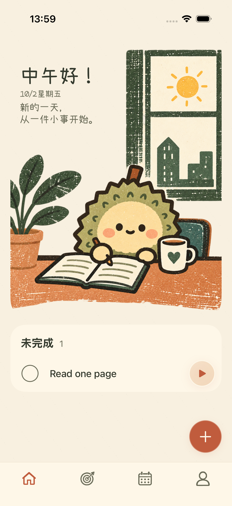
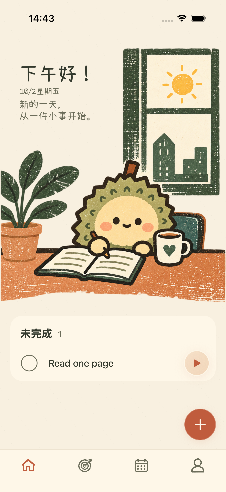

# 首页插画贴边修复

用户指出首页图片仍没有到达屏幕边缘。上一次修复恢复了图片大小，但未解决有未完成任务时的左右裁切。

## 问题与调整

有未完成任务时，首页使用带左右 18 点留白的分组列表。虽然图片通过负边距恢复了完整尺寸，列表仍裁掉两侧内容；因此问候文案的大小检查通过，实际图片却仍未贴边。

本次使用无左右留白的普通列表承载图片，去除图片的负边距。任务卡片单独保留 18 点左右留白及奶油色圆角背景，图片不再受卡片边界影响。任务的完成、恢复、侧滑删除与撤销，以及新增、计时和导航行为继续沿用原规则。

## 实际截图

| 修复前：图片两侧被裁切 | 修复后：图片到达屏幕边缘 |
| --- | --- |
|  |  |

小屏有任务时也保持相同的图片比例和贴边显示：

## 验证范围

首页状态切换测试补充了真实截图边缘检查：容纳素材本身极薄的未印刷纹理后，沿屏幕左右各 2–5 点的窄条区域逐列确认桌面插画的陶土色印刷内容可见。该检查能发现“图片尺寸正确、但被父容器裁切”的问题，覆盖无任务、添加任务、全部完成及恢复任务。

在修改页面前，新检查通过无任务状态，并在添加任务后失败，左右边缘没有插画墨色。修复后使用同一检查验证，并另行核对单任务、多任务和小屏截图。

测试最终结果及截图来源见[验证清单](liuli-preview/home-edge-validation-20261002.json)。验证设备为 iPhone 17 Pro 和 iPhone SE 第三代、iOS 26.5 模拟器；未进行真机验收。

| 验证 | 实际结果 |
| --- | --- |
| Pro 首页专项 | 4 项通过，覆盖任务状态、删除撤销和运行中的计时入口 |
| SE 首页专项 | 5 项通过，覆盖首次打开、任务状态、导航和大字号 |
| 整套单元测试 | 82 项、15 个套件全部通过 |
| Pro 整套界面测试 | 37 项全部通过 |
| 最终逐列边缘检查 | Pro、SE 各 1 项通过，均覆盖无任务、添加、全部完成和恢复 |
| 通用模拟器构建 | 成功 |

只读复核未发现阻止交付的代码问题；原先将边缘像素合并统计的检查已加严为逐列检查。

## 关键文件

- `ios/ZhouJi/Features/Today/TodayView.swift`：解除插画行的列表裁切，将留白限制在任务卡片。
- `ios/ZhouJiUITests/ZhouJiV2UITests.swift`：补充首页实际可见边缘检查。
- `docs/02-产品需求文档-PRD.md`：明确图片贴边、任务卡片独立留白。
