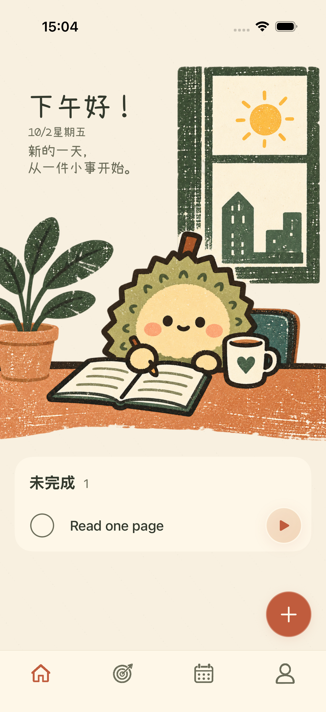

# 首页插画透明边修复

用户再次指出首页场景与屏幕边缘还有空隙。列表已经没有左右留白，剩余空隙来自插画素材自身的透明边。

## 原因与处理

`LiuliToday.png` 原始尺寸为 1145×1374。桌面区域的不透明内容从左侧约第 6 像素开始，右侧也有数个半透明像素；按屏幕宽度显示时，形成约 1–2 点的浅色细边。

此前边缘检查从离屏幕边缘 2 点处开始，容许素材固有纸边，未满足用户要求。本次检查包含最外侧第 0 像素，并逐列确认插画内容实际可见。旧实现在无任务状态的第 0 列失败，证实该细边仍存在。

插画在绘制时等比放大 2%，把透明边延伸到视口之外，再裁到页面边界。该处理保留原始布局尺寸，问候文字的字号、位置以及新增按钮位置不随之改变；四种任务状态使用同一绘制规则。素材文件保持原样。

## 实际截图

| 前一版：素材仍有细边 | 本次：消除素材细边 |
| --- | --- |
|  |  |

## 验证

首页状态切换检查覆盖无任务、添加任务、全部完成和恢复，检查两侧最外侧像素的实际桌面墨色，并继续比较文案大小与横向位置。小屏同时检查新增入口完整位于导航上方、添加和恢复可用。

| 检查 | 结果 |
| --- | --- |
| iPhone 17 Pro 首页状态与边缘检查 | 1 项通过 |
| iPhone SE 第三代首页导航、完成/恢复与边缘检查 | 3 项通过 |
| iPhone 17 Pro 完整回归 | 82 项单元测试、37 项界面测试通过 |
| 通用 iOS 模拟器构建 | 通过 |

有未完成任务的实测截图中，最外侧像素列的桌面墨色占比：Pro 左侧 27.65%、右侧 16.84%；SE 左侧 33.47%、右侧 20.82%。此前 Pro 的两侧最外列均为 0%。这确认插画内容实际抵达屏幕边缘，而不是仅靠容器宽度判断。

最终运行结果及截图来源见[验证清单](liuli-preview/home-bleed-validation-20261002.json)。设备为 iPhone 17 Pro 和 iPhone SE 第三代、iOS 26.5 模拟器，未进行真机验收。

## 关键文件

- `ios/ZhouJi/Features/Today/TodayView.swift`：绘制时放大并裁到视口，布局尺寸不变。
- `ios/ZhouJiUITests/ZhouJiV2UITests.swift`：从最外侧像素开始检查图片边缘。
- `docs/02-产品需求文档-PRD.md`：明确素材透明边也不能留下可见空隙。
