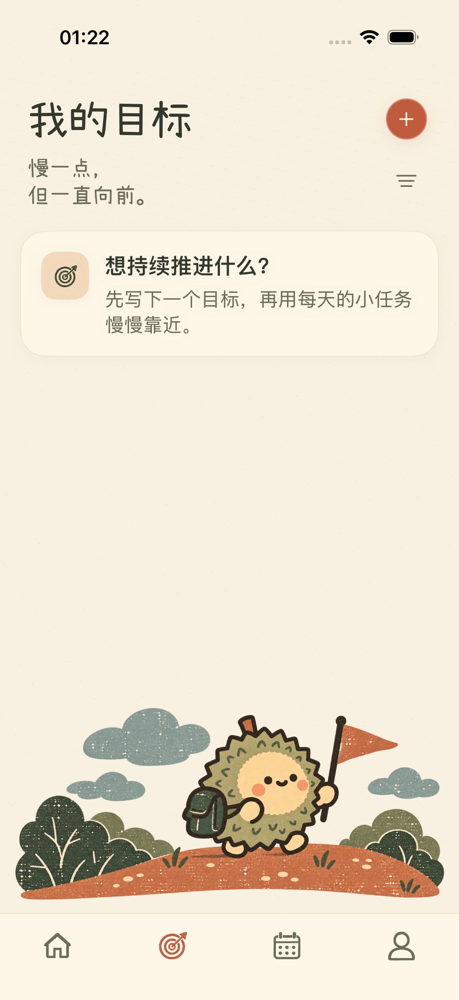
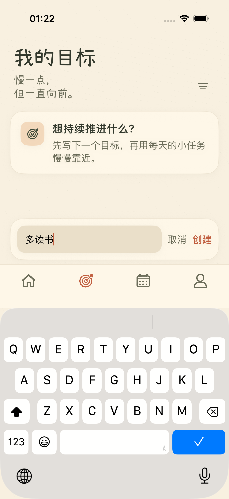
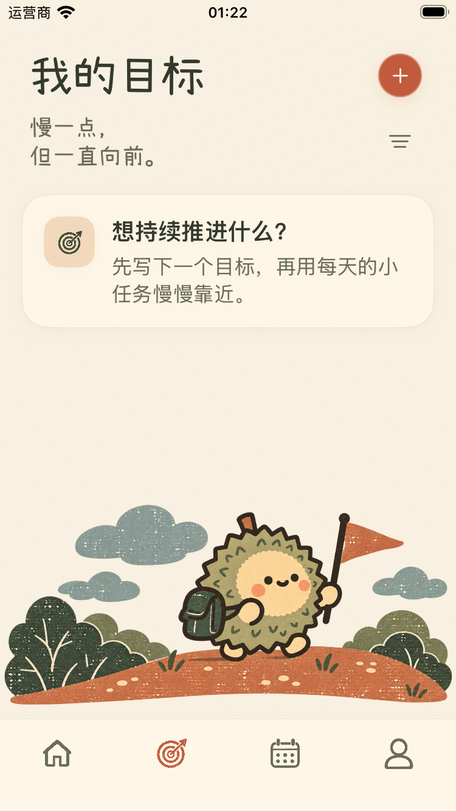
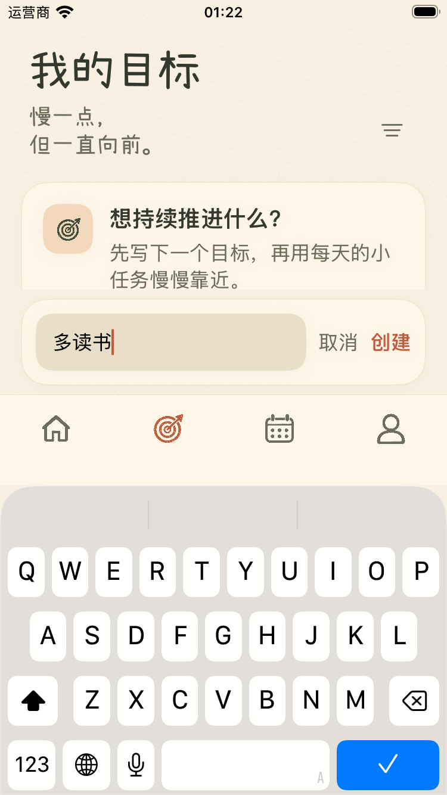

# 新增目标背景固定修复

新增目标时，输入栏和键盘仍正常避让，旅行插画保持未编辑时的位置与比例；键盘可以遮挡插画，取消或创建目标后恢复完整显示。背景从列表底部移至目标页固定画布，不再跟随缩短的列表上移。产品规则同步至 PRD。

主要修改：`ios/ZhouJi/Features/Goals/GoalsView.swift`。没有修改主导航、图像素材或字体。

## 验证

- 旧实现回归失败：SE 插画边缘由 516 点移至 168 点。证据：`/private/tmp/zhouji-goal-background-red-fresh.xcresult`。首次旧缓存运行实际执行 0 项用例，不计为验证。
- 最终实现 SE 4 项界面回归通过：背景与键盘、取消/创建、大字体目标页面、固定顶部新增入口、首页单任务计时。记录：`/private/tmp/zhouji-goal-background-final-se.xcresult`（4 项用例，其中背景用例包含取消和创建）。
- Pro 主页面外观与导航检查通过：`/private/tmp/zhouji-goal-background-final-pro.xcresult` 中 `testReferenceAppearanceAndNavigation`。同轮背景用例在初始图像采样处未命中透明边，未将该测试包视为整体通过。
- 将边缘采样由 12 点改至 14 点，仍位于卡片和输入栏之外；SE、Pro 各 1 项背景流程复测通过：`/private/tmp/zhouji-goal-background-check-se.xcresult`、`/private/tmp/zhouji-goal-background-check-pro.xcresult`。比较实际插画像素，键盘弹出后不允许在原位置上方出现插画；取消后位置恢复。初始截图读取失败或初始插画缺失均会导致用例失败。
- 最终源码模拟器构建通过：`/private/tmp/zhouji-goal-background-final-build.log`。
- 本轮验证相关流程，没有重新运行完整套件，未验证真机。
- 源码 SHA256：`6ee5bae59099508e9430d65534976fe6146d52c3c8468ca62ac71b095990dc4d`。

## 实际截图

