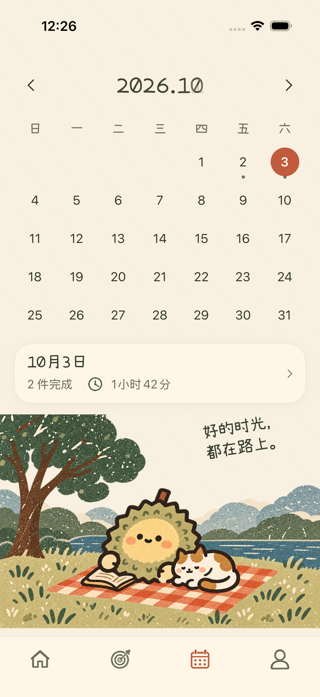
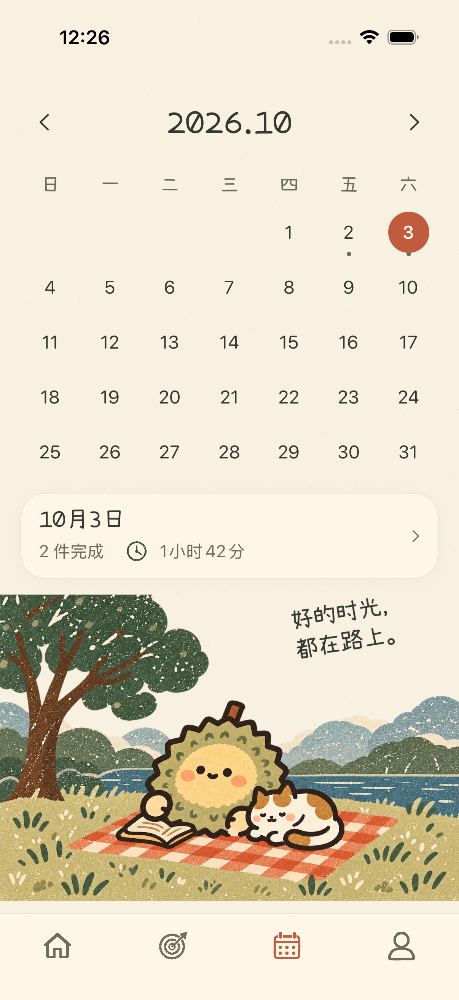
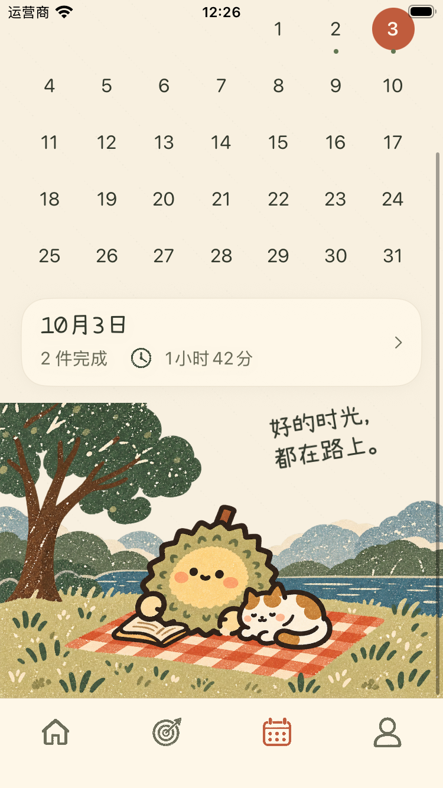

# 日历插画调整

按照用户上传的参考图，使用内置 imagegen 工具重新生成复古丝网印刷海报风、手绘平面插画。沿用目标页角色造型和配色：苔绿榴莲、浅黄面孔、棕色不规则轮廓、粉橙腮红、陶土橙野餐垫与灰蓝远景。

## 实现

- 榴榴和小猫在野餐垫上阅读，左侧树木、远山、湖面、草地铺满页面宽度。
- 上部透明区域融入现有纸张背景，短句由界面独立绘制。
- 按页面宽度保持插画比例；收紧上部装饰留白，底部草地与导航底座相接。小屏内容允许滚动。
- 日期选择、月份切换、当天统计和当天回顾沿用既有行为。

代码：`ios/ZhouJi/Features/Calendar/CalendarView.swift`。
素材：`ios/ZhouJi/Assets.xcassets/LiuliCalendarReference.imageset/LiuliCalendarReference.png`。

## 验证

iPhone 17 Pro 和 iPhone SE 各运行日历日期选择、月份切换与回到今天的专项界面用例，并检查实际截图。通用模拟器构建通过。此验证不代表全量回归或真机验证。

## 生图提示词

使用用户上传日历参考图作为构图参考，使用项目 `LiuliGoalsReference.png` 作为角色和印刷质感参考。透明背景。

Create a standalone illustration asset for the calendar screen of a Chinese iPhone app. Image 1 is the composition and style reference, extract/recreate ONLY the lower picnic scene, NOT the phone, calendar, UI or lettering. Image 2 is supporting character identity and print-texture reference: use the same little olive green durian mascot, creamy yellow round face, tiny black eyes and mouth, pink cheeks, thick dark brown irregular hand-drawn outlines. New scene: durian sitting on an orange and cream checkered picnic blanket with an open book by its left hand; a curled sleeping white and orange cat immediately beside it on the right. Large moss green leafy tree with warm brown trunk at far left, muted blue-gray distant mountains/clouds and a thin lake behind them, olive grass with sparse hand drawn tufts foreground. Matching vintage silkscreen poster + hand drawn FLAT illustration, distressed ink flecks, limited olive green, faded mustard, terracotta, cream, dark brown and dusty blue. Flat color separations, no 3D, no lighting, no glossy shading, no watercolor wash. Aspect ratio 6:5 or square. Main characters occupy lower center and are large enough to recognize. Tree reaches left edge, distant mountains right edge, grass fully extends across BOTH left/right edges and completely covers the bottom edge. Upper right area is empty transparent space for separately rendered UI quote. Transparent upper sky, irregular cloud/mountain top silhouettes. All objects fully drawn, no phones, no UI, no labels, absolutely no text, no border, no vignette. Match the gentle sleepy picnic composition of Image 1.
