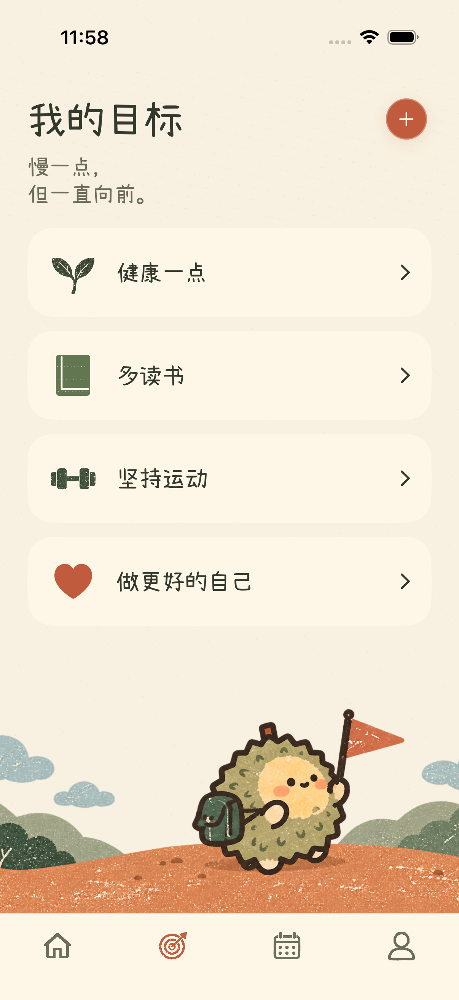
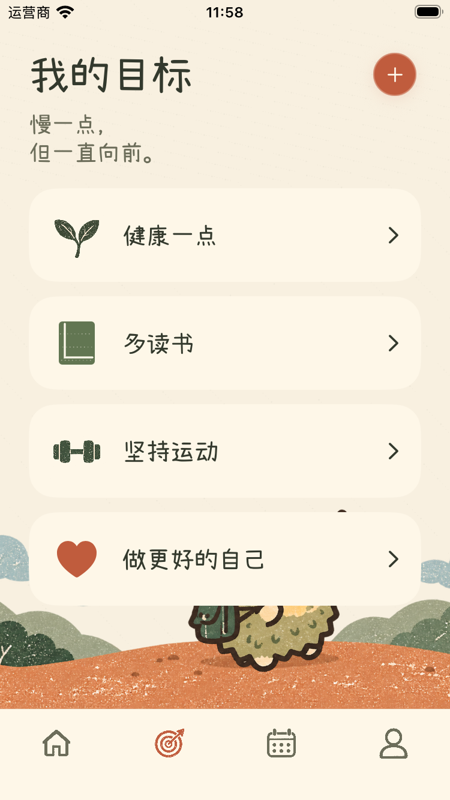

# 目标列表参考图调整

以用户上传的目标列表设计图为依据，调整目标列表，保留今天、目标、日历、我的导航顺序。

## 实现

- 标题加粗，目标名称使用现有小赖手写字体。
- 卡片保留图标、名称和箭头，移除可见进度数字；详情和无障碍说明继续提供任务完成进度。
- 使用简洁叶片、闭合书本、哑铃和陶土橙心形图标。已有其他目标图标仍可使用。
- 点击“我的目标”标题打开筛选，取消单独筛选图标。
- 新生成复古丝网印刷风旅行插画，山坡延伸到左右边缘；卡片使用不透明奶油底色。
- 新增目标时插画保持位置，输入区域和底部导航避让键盘。

主要代码：`ios/ZhouJi/Features/Goals/GoalsView.swift`。
素材：`ios/ZhouJi/Assets.xcassets/LiuliGoalsReference.imageset/`。

## 实际截图

截图来自使用隔离测试数据的模拟器，不改变用户数据。四个目标用于对照参考图，并非内置默认目标。

## 验证

- iPhone 17 Pro：目标创建时背景固定、四张卡片与进度无障碍说明、外观和导航，3 个专项用例通过。
- iPhone SE：目标创建时背景固定、大字体添加与保存、四张卡片与进度无障碍说明、滚动后新增入口和取消恢复，4 个专项用例通过。
- 最后将卡片底色改为完全不透明，分别在上述两台模拟器重跑四卡片用例并检查实际截图。
- 通用 iOS 模拟器构建通过。

这是目标页专项验证，不代表全量回归或真机验证。字体和插画按参考风格调整，未宣称与设计图逐像素相同。小屏内容超出时允许滚动，卡片优先于背景插画。
