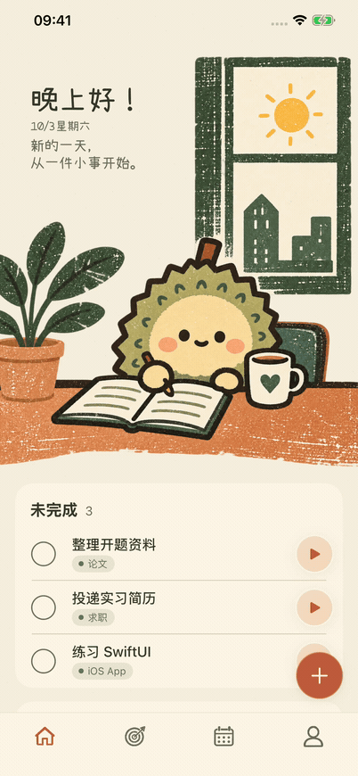

# 首页完成动效预览

本轮仅调整首页“完成任务”和“今天全部完成”两处反馈，沿用复古丝网印刷插画。

- 完成任务：勾选圆圈收缩至 88%，约 0.12 秒后恢复，任务随约 0.28 秒的列表过渡移入已完成区域。期间禁用同一行的完成与计时按钮。
- 全部完成：复用同一首页标题和插画，提示文字以约 0.28 秒交叉淡入；插画尺寸和布局位置保持稳定。
- 系统“减少动态效果”开启时直接更新。目标页等其他页面保留现有行为。

## 实际操作预览

[原尺寸视频（5.5 秒）](liuli-preview/today-completion-motion-20261003.mp4)

预览来自独立 iPhone 14 Plus / iOS 26.5 模拟器，使用内存示例数据。前半段完成一项任务，后半段完成最后一项；仅剪去等待和中间的另一项操作，保留实际动画速度。

## 验证

- 91 项单元测试通过。
- 三项既有首页界面测试通过：全部完成后新增与恢复任务、单任务计时按钮可点击、空状态／有任务／全部完成／恢复任务时标题比例和插画边缘保持一致。
- 逐帧检查录屏确认勾选反馈、列表过渡与文案交叉淡入。系统减少动态效果的条件分支已检查，此次未进行该系统设置的手动切换验证。
- 模拟器测试包含应用构建；未运行完整界面回归。

本机结果文件：`/private/tmp/zhouji-completion-motion-verified.xcresult`、`/private/tmp/zhouji-completion-motion-layout.xcresult`。

本次未更新 App Store 构建，已上传的构建 2 不包含这轮动画。

## 倒数第二项完成时跳变修复

复现发现：原有代码在任务数从两项变成一项时，将 80 点的底部操作留白移动到未完成与已完成分组之间，叠加列表行间距后，两个分组的实测间距从 16 点变成 112 点。同时，单任务自动定位也会在这个过程中触发。

修复后留白始终位于列表末尾，完成倒数第二项不触发自动定位。新增或恢复单项任务、回到首页或收起计时页时仍可定位到任务本身，使操作按钮避开悬浮加号。

新增界面回归测试检查分组间距、插画纵向位置，以及剩余任务可滚动到计时按钮未被遮挡的位置。修改前测试以 112 点与 16 点不一致失败；修改后通过。

本轮 91 项单元测试、4 项首页界面测试通过。结果：`/private/tmp/zhouji-penultimate-before.xcresult`（复现失败）、`/private/tmp/zhouji-penultimate-fixed.xcresult`（修复后通过）。
